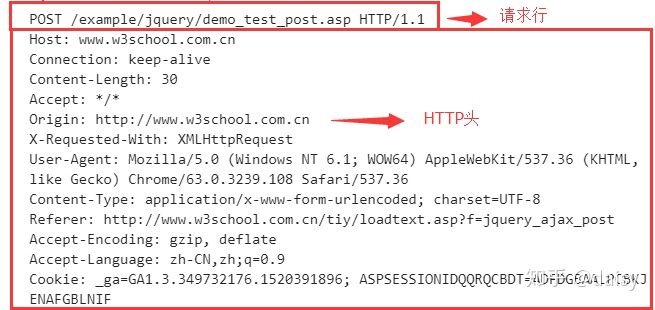
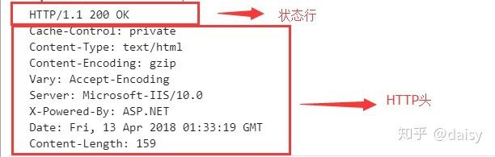
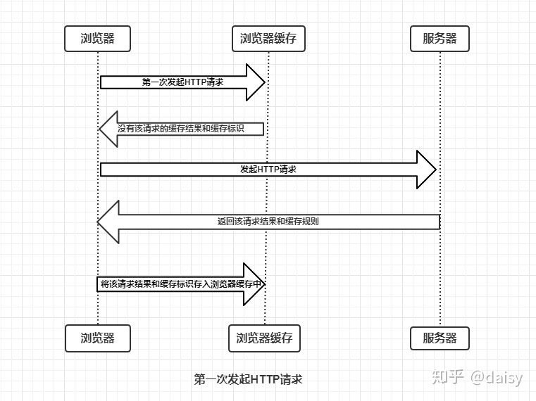
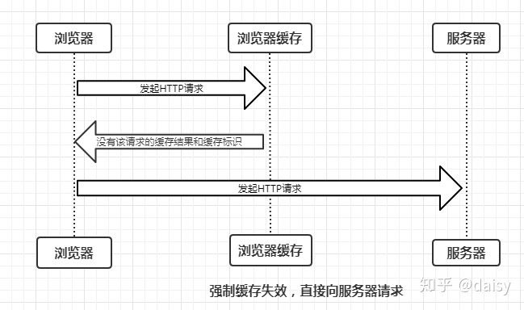
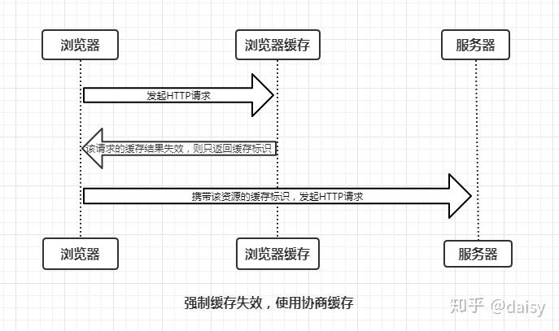
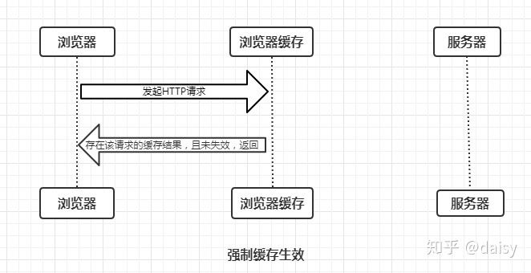
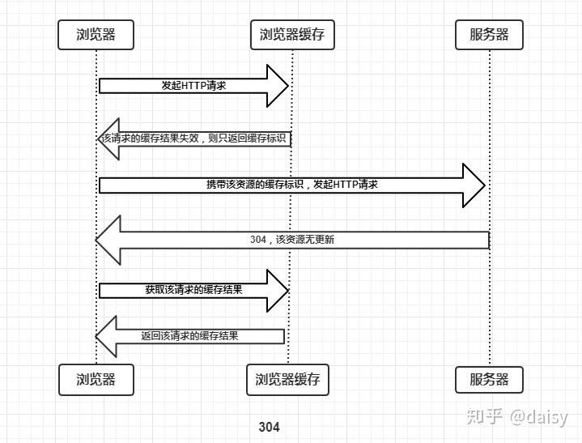
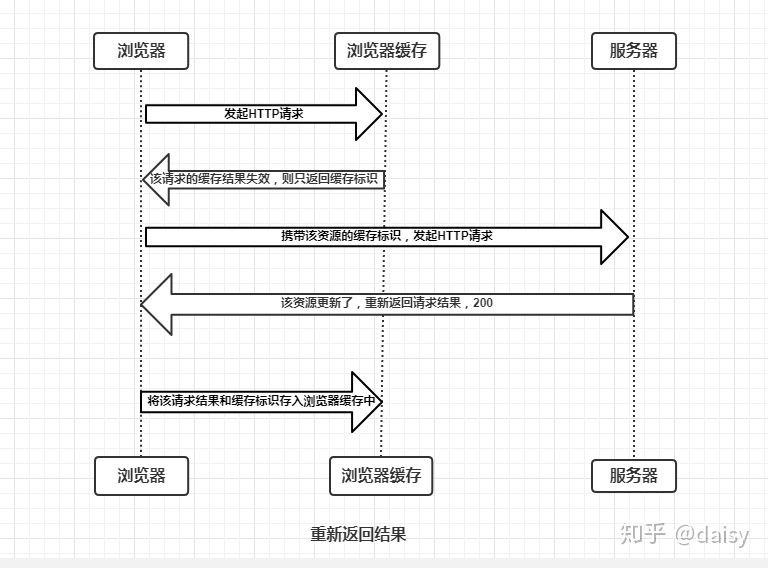
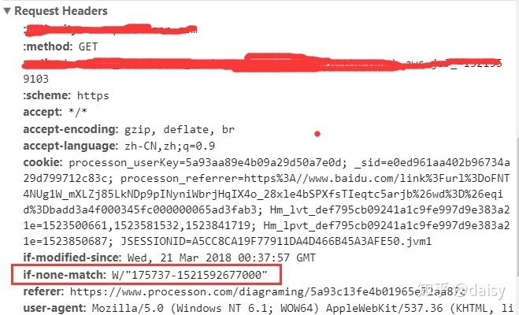
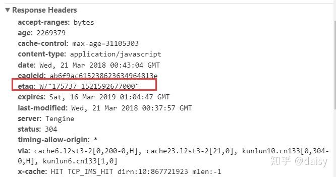

# 浏览器缓存机制

HTTP 报文分为两种：

1. HTTP request 报文(分为**请求行**，**HTTP 头**，**请求主体**)

   

2. HTTP response 报文(分为**状态行**，**HTTP 头**和**响应主体**)

**通用信息头**： 表示 request 和 response 都支持的头部信息，包含：Cache-Control、Connection、Date、Pragma、Transfer-Encoding、Upgrade、Via

## 缓存过程分析

浏览器第一次与服务器通信，会先检查是否有相应的缓存以及缓存标识，如果没有，则发起第一次 HTTP 请求，拿到结果之后，根据HTTP 头部的缓存标识，决定是否将其存入缓存

从上图我们知道了：

* 浏览器每次发起请求都会在浏览器缓存中查找结果以及表示
* 浏览器每次拿到结果都会根据头部的缓存标识决定是否存入缓存

## 强制缓存

控制强制缓存的字段分别是**Expires**和**Cache-Control**，其中Cache-Control优先级比Expires高。

**强制缓存就是向浏览器缓存查找该请求结果，并根据该结果的缓存规则来决定是否使用该缓存结果的过程**，强制缓存的情况主要有三种

1. 不存在该缓存结果和缓存标识，直接发起请求

2. 存在该缓存结果和缓存标识，但该结果已失效, 则使用协商缓存

   

3. 存在该缓存结果和缓存标识，且该结果尚未失效，直接返回该结果

### Expires

Expires是**HTTP/1.0**控制网页缓存的字段，其值为服务器返回该请求结果缓存的到期时间，即再次发起该请求时，如果客户端的时间小于Expires的值时，直接使用缓存结果。

到了 **HTTP/1.1**之后，expires 被 cache-control 所替代，原因是 expires 使用客户端和服务器时间做对比，有的时候，例如时区不一样，会导致这个字段无效，那么强制缓存将没有意义。

### **Cache-Control**

在HTTP/1.1中，Cache-Control是最重要的规则，主要用于控制网页缓存，主要取值为(注意这里 no-cache 和 no-store 的区别)：

* **public**： 所有内容都将被缓存（`客户端和代理服务器都可缓存`）
* **private**：所有内容`只有客户端`可以缓存，**Cache-Control的默认取值**
* **no-cache**：每次不经过缓存验证，直接发送给服务器验证，可能会返回304，这种情况就直接读缓存。
* **no-store**：所有内容都不会被缓存，即不使用强制缓存，也不使用协商缓存
* **max-age=xxx (xxx is numeric)**：缓存内容将在xxx秒后失效

## 协商缓存

请求头中控制协商缓存有 **Etag/If-None-Match** 和**Last-Modified / If-Modified-Since**，其中 **Etag/If-None-Match** 的优先级更高。同时存在时只有 Etag/If-None-Match

协商缓存就是当强制缓存过期之后，使用缓存标识向服务器发起请求，由服务器决定是否使用缓存，这种情况有两种：

1. 协商缓存生效，服务器返回304

2. 协商缓存失败，服务器返回200以及请求内容

### **Last-Modified / If-Modified-Since**

Last-Modified是服务器响应请求时，返回该资源文件在服务器最后被修改的时间，如下。这个字段随缓存一起存在客户端，当对该缓存资源发起请求的时候，请求会自动带上这个字段，如果服务器资源没有修改过，则返回304，读缓存，否则就返回200以及请求内容。

## **Etag / If-None-Match**

和 上面的字段不同，Etag 是服务器返回的一个该**资源的唯一标识**

注意 If-None-Match 是在请求中的字段，Etag 是存在服务器的字段。当服务器收到包含有 if-None-Match字段的请求时，会和自己存放的 Etag做对比，如果一致，则返回304，否则200以及内容.

请求头中：

回复头中：

## 缓存的两种类型

缓存由 from-memory-cache 和 from-disk-cache 两种，即内存缓存和磁盘缓存，读取优先级 memory > disk。

读取方法：

**访问[https://heyingye.github.io/](https://link.zhihu.com/?target=https%3A//heyingye.github.io/)** **–> 200 –> 关闭博客的标签页 –> 重新打开[https://heyingye.github.io/](https://link.zhihu.com/?target=https%3A//heyingye.github.io/)** **–> 200(from disk cache) –> 刷新 –> 200(from memory cache)**

可以看到，关闭标签页之后相应的memory缓存失效，读取 disk 缓存，在开着页面时候刷新是直接读取 memory 缓存的。

- **内存缓存(from memory cache)**：内存缓存具有两个特点，分别是**快速读取**和**时效性**：

- - **快速读取**：内存缓存会将编译解析后的文件，直接存入该进程的内存中，占据该进程一定的内存资源，以方便下次运行使用时的快速读取。
  - **时效性**：一旦该进程关闭，则该进程的内存则会清空。

- **硬盘缓存(from disk cache)**：硬盘缓存则是直接将缓存写入硬盘文件中，读取缓存需要对该缓存存放的硬盘文件进行I/O操作，然后重新解析该缓存内容，读取复杂，速度比内存缓存慢。

在浏览器中，浏览器会在js和图片等文件解析执行后直接存入内存缓存中，那么当刷新页面时只需直接从内存缓存中读取(from memory cache)；而css文件则会存入硬盘文件中，所以每次渲染页面都需要从硬盘读取缓存(from disk cache)。

参考:[彻底理解浏览器的缓存机制](https://zhuanlan.zhihu.com/p/53507705?utm_source=wechat_session&utm_medium=social&utm_oi=984754533125271552&utm_content=first)