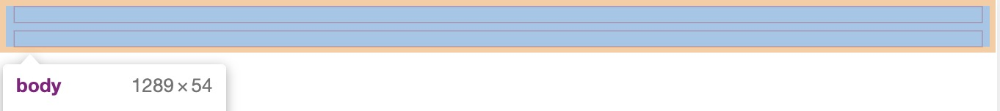
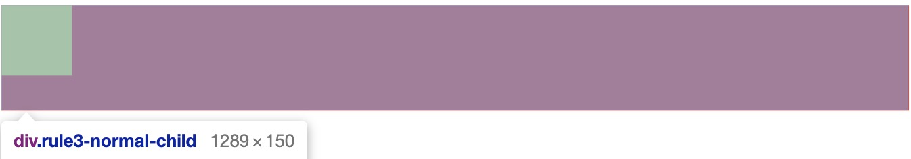
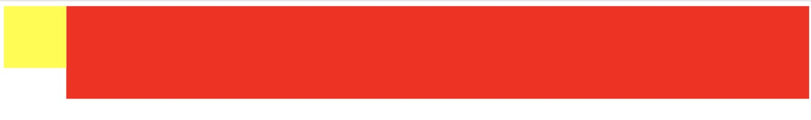
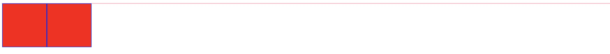
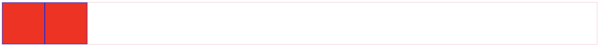
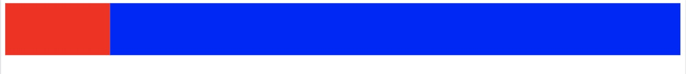
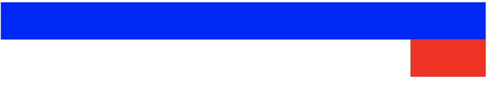
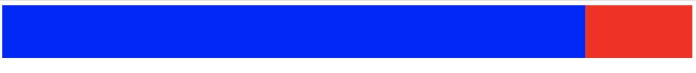

# BFC 布局

BFC(Block formatting context)直译为"块级格式化上下文"。它是一个独立的渲染区域，只有Block-level box参与， 它规定了内部的Block-level Box如何布局，并且与这个区域外部毫不相干。

## 产生 BFC 的原因

1. 根元素，即<body></body>下直接写的块级元素
2. float 值不为 none
3. position 为 absolute 或者 fixed
4. display:inline-block/table-cell/table-caption/flex/inline-flex
5. overflow 不为 visible


## BFC 内部规则

1. 内部的box一行一行排列
2. 属于同一个BFC的两个box在垂直方向的margin会发生重叠
3. 每个元素的margin box的左边， 与包含块border box的左边相接触(对于从左往右的格式化，否则相反)。即使存在浮动也是如此
4. BFC区域与外部的float box不会发生重叠
5. BFC就是页面上的一个隔离的独立容器，容器内外的元素不会相互影响
6. 在BFC内部的浮动元素也计算在BFC的宽度之内


## Rule1 & Rule2

* 内部的box一行一行排列
* 属于同一个BFC的两个box在垂直方向的margin会发生重叠

```javascript
<html>
<head>
    <title>BFC</title>
    <style type="text/css">
        .rule1{
            border: 1px solid red;
            margin: 10px;
            height: 20px;
        }
    </style>
</head>
<body>
<div class="rule1"></div>
<div class="rule1"></div>
</body>
</html>
```

有上面的代码，可以看到两个 box 写在 body 下，触发 BFC 布局



* 可以看到两个 box 是一行一行排布的
* 可以看到两个 box 如果 margin 不重叠，大小应该为2(border)+2( border) + 20(height) + 20(height) + 2 * 10(margin)  = 64, 可视现在 height 为54，发生了 margin 重叠


##Rule3

* 每个元素的margin box的左边， 与包含块border box的左边相接触(对于从左往右的格式化，否则相反)。即使存在浮动也是如此

```javascript
<html>
<head>
    <title>BFC</title>
    <style type="text/css">
        .rule3-float-child{
            float: left;
            width: 100px;
            height: 100px;
            background-color: yellow;
        }
        .rule3-normal-child{
            background-color: red;
            height: 150px;
        }
    </style>
</head>
<body>
<div class="rule3-float-child"></div>
<div class="rule3-normal-child"></div>
</body>
</html>
```




可以看到上面的 normal-child 的左边和包含它的 box(body)的左边相接触


## Rule4 & Rule5

* BFC区域与外部的float box不会发生重叠
* BFC就是页面上的一个隔离的独立容器，容器内外的元素不会相互影响

```javascript
<html>
<head>
    <title>BFC</title>
    <style type="text/css">
        .rule3-float-child{
            float: left;
            width: 100px;
            height: 100px;
            background-color: yellow;
        }
        .rule3-normal-child{
            background-color: red;
            height: 150px;
          	overflow:hidden
        }
    </style>
</head>
<body>
<div class="rule3-float-child"></div>
<div class="rule3-normal-child"></div>
</body>
</html>
```

 只需要把之前的 normal-child 加一个 overflow: hidden，则这个 box 会变成 BFC 容器，它和前面的 float 元素不会发生重叠。



同时红色部分就是一个 BFC 容器，可以看出两个部分不会互相影响。


## Rule6

* 在BFC内部的浮动元素也计算在BFC的宽度之内

```javascript
<html>
<head>
    <title>BFC</title>
    <style type="text/css">
        .container{
            border: 1px solid pink;
        }
        .child{
            float: left;
            width: 100px;
            height: 100px;
            background-color: red;
            border: 1px solid blue;
        }
    </style>
</head>
<body>
<div class="container">
<div class="child"></div>
<div class="child"></div>
</div>

</body>
</html>
```

以上代码的 container 不是一个 BFC 容器



可以看到容器是无法包裹住内部元素的。现在给 container 增加一条: overflow: hidden 使其变成 BFC 容器



可以看到这个容器已经可以包裹住所有元素了，即使他们是浮动的。


## BFC实践

### BFC实现两栏布局

利用的原理是 BFC 和外部 float 元素不重叠的原理

1. 左边固定右边自适应

```javascript
<html>
<head>
    <title>BFC</title>
    <style type="text/css">
        .left{
            float: left;
            height: 100px;
            width: 200px;
            background-color: red;
        }
        .right{
            overflow: hidden;
            height: 100px;
            background-color: blue;
        }
    </style>
</head>
<body>
<div class="left"></div>
<div class="right"></div>
</body>
</html>
```



上面left 是左浮动的，右侧因为设置了 overflow= hidden 所以是 BFC，因此不会和左侧重叠。并且犹豫 BFC 元素是按照行排列的，所以会占满一行。

2. 右边固定左边自适应

```javascript
<html>
<head>
    <title>BFC</title>
    <style type="text/css">
      .left{
          height: 100px;
          overflow: hidden;
          background: #0000FF;
			}
			.right{
				float: right;
				width:200px;
				height:100px;
				background: red;
			}
    </style>
</head>
<body>
<div class="right"></div> // 顺序改变了！！right 和 left 互换了位置
<div class="left"></div>

</body>
</html>
```

这次换成了右边固定，左边自适应，但是如果 html 元素顺序不变的话就会产生下面的效果，因为 BFC 是默认占满一行的，如果上来的第一个是 BFC 那么这一行就先占满了，所以**浮动元素应该**在最前面



修改为 right 在前，就可以完成



## BFC 实现三栏布局

相应的，实现三栏布局也很容易，两侧固定，中间自适应(又叫**圣杯布局**或者**双飞翼布局**)， 只要先添加两个浮动元素，最后添加 BFC 布局的一个中间条就可以达到。

顺序一定要是先添加浮动元素，再添加 BFC

```javascript
<html>
<head>
    <title>BFC</title>
    <style type="text/css">
      .container{
				overflow: hidden;
			}
			.left{
				width:200px;
				height:100px;
				float: left;
				background: red;
			}
			.right{
				width:200px;
				height:100px;
				float: right;
				background: #0000FF;
			}
			.mid{
				overflow: hidden;
				height: 100px;
				background: yellow;
			}
    </style>
</head>
<body>
		<div class='container'>
			<div class="left"></div>
			<div class='right'></div>
			<div class='mid'></div>
		</div>

</body>
</html>
```

实现效果如下：


## Table-cell 实现圣杯布局

```javascript
<html>
<head>
    <title>BFC</title>
    <style type="text/css">
      .container{
				display:table
			}
			.left{
        display:table-cell;
				width:200px;
				height:100px;
				float: left;
				background: red;
			}
			.right{
        display:table-cell;
				width:200px;
				height:100px;
				float: right;
				background: #0000FF;
			}
			.mid{
        width:100%;
        display:table-cell;
				overflow: hidden;
				height: 100px;
				background: yellow;
			}
    </style>
</head>
<body>
		<div class='container'>
			<div class="left"></div>
			<div class='mid'></div>
			<div class='right'></div>
		</div>

</body>
</html>
```

这种方法的思路是把 container 设置为 table 布局，把小块设置为 display: table-cell，这样设置了左右的宽度之后，中间宽度设为百分百就可以自动撑满剩余宽度，实现效果同上面的图一样。

参考：[BFC与多列布局](https://www.jianshu.com/p/4c01c7913b40)

