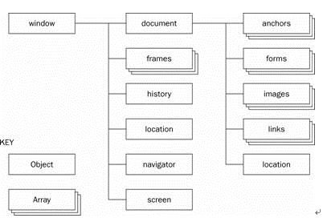

# Bom 

Bom: browser object model, 简称浏览器对象模型

Dom: document object model, 简称文档对象模型

## Bom

Bom 提供了独立于内容而与浏览器进行交互的对象，BOM主要用于管理窗口与窗口之间的通讯，因此其核心对象是window，BOM由一系列相关的对象构成，并且每个对象都提供了很多方法与属性

BOM提供了一些访问窗口对象的一些方法，我们可以用它来移动窗口位置，改变窗口大小，打开新窗口和关闭窗口，弹出对话框，进行导航以及获取客户的一些信息如：浏览器品牌版本，屏幕分辨率。但BOM最强大的功能是它提供了一个访问HTML页面的一入口——document对象，以使得我们可以通过这个入口来使用DOM的强大功能

### window 对象关系属性

- parent：如果当前窗口为frame，指向包含该frame的窗口的frame （frame）
- self ：指向当前的window对象，与window同意。 （window对象）
- top ：如果当前窗口为frame，指向包含该frame的top-level的window对象
- window ：指向当前的window对象，与self同意。
- opener ：当窗口是用javascript打开时，指向打开它的那人窗口（开启者）

### window 对象的方法

> alert(), blur(), clearInterval(), setInterval(), clearTimeout(), setTimeout(), close(), confirm(), focus(), moveBy(), moveTo(), open(), prompt(), resizeBy(), resizeTo(), scrollBy(), scrollTo()

## window.history

> back()方法，加载 history 列表中**前一个**URL
>
> forward() 加载 history 列表中的**下一个** URL
>
> go(num) 加载 history 列表中的**某个具体**页面

## window.location

以https://www.cnblogs.com/cdufaker/p/9860317.html为例子

属性

> window.location.hash 设置或返回从井号 (#) 开始的 URL: ""
>
> window.location.host 设置或返回当前主机名和端口号: "www.cnblogs.com"
>
> window.location.hostname 返回当前主机名: "www.cnblogs.com"
>
> window.location.href返回当前完整 URL: "https://www.cnblogs.com/cdufaker/p/9860317.html"
>
> window.location.pathname: "/cdufaker/p/9860317.html"
>
> window.location.port 返回当前URL 端口号:""
>
> window.location.protocol: 返回当前协议 "https:"
>
> window.location.search 返回? 后的 url 查询的部分。

方法

> window.location.assign: 加载新的文档，这和直接将值赋给 location.href属性效果是一样的。
>
> window.location.reload(): 重新加载文档，但是会用协商缓存字段去检测，如果未修改则直接读缓存。
>
> window.location.replace(): 用新的文档替换当前文档，在 history 中不会生成新的记录。

## window.navigator

> window.navigator.appCodeName: 返回浏览器引擎代码: "Mozilla"
>
> window.navigator.appName:返回浏览器的名称: "Netscape"
>
> window.navigator.appVersion: "5.0 (Macintosh; Intel Mac OS X 10_14_6) AppleWebKit/537.36 (KHTML, like Gecko) Chrome/84.0.4147.125 Safari/537.36"
>
> window.navigator.language: "en-AU"
>
> window.navigator.cookieEnabled: true
>
> window.navigator.onLine表示是否在线，否则是脱机工作: window.navigator.onLine
>
> window.navigator.platform: 表示操作系统平台;"MacIntel"
>
> window.navigator.userAgent: 返回客户机发送的 useragent 的值: "Mozilla/5.0 (Macintosh; Intel Mac OS X 10_14_6) AppleWebKit/537.36 (KHTML, like Gecko) Chrome/84.0.4147.125 Safari/537.36"

## window.screen

> window.availHeight: 返回屏幕高度
>
> window.availWidth: 返回屏幕宽度

BOM 下的各种属性和教程上都并非完全一样，使用的时候记得查文档。

参考:

1.  [bom 和 dom 的区别](https://www.cnblogs.com/cdufaker/p/9860317.html)