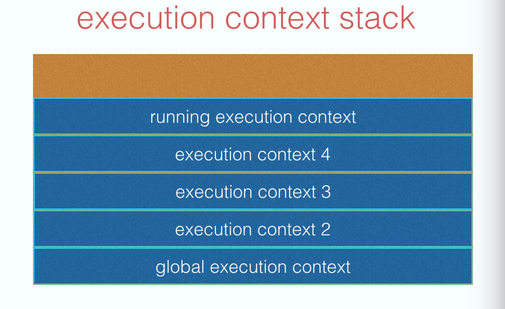
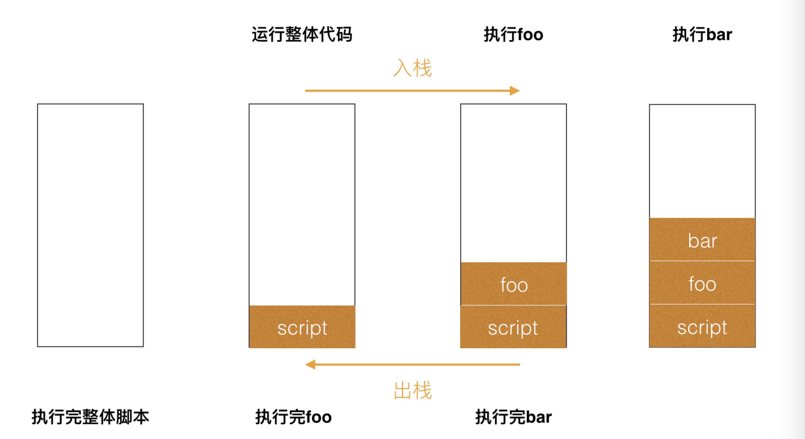

# Event Loop

event loop翻译出来就是**事件循环**，可以理解为实现异步的一种方式，他存在的意义是:

**因为 js 是一门事件驱动的语言，为了协调事件，例如用户交互，脚本，渲染，网络等，用户代理必须使用本节所述的`event loop`。**

**事件循环（Event Loop）** 是让 JavaScript 做到既是**单线程**，又绝对**不会阻塞**的核心机制，也是 JavaScript **并发模型（[Concurrency Model](https://link.zhihu.com/?target=https%3A//developer.mozilla.org/en-US/docs/Web/JavaScript/EventLoop)）**的基础，是用来协调各种事件、用户交互、脚本执行、UI 渲染、网络请求等的一种机制。


## Macro task

一个 eventloop 会有**一个或者多个**macro task 队列。

当用户代理安排一个任务，必须将该任务增加到相应的event loop的一个tsak队列中。

macro task 任务源头:

* setTimeout
* setInterval
* setImmediate
* I/O
* UI rendering

## Micro task

每个 eventloop 都有一个 **micro task** 队列.

一个 micro task 会被排进 micro task 队列而不是 macro task 队列。

micro task 任务源头:

* process.nextTick
* promises
* Object.observe
* MutationObserver


## Event Loop处理过程

一个event loop只要存在，就会不断执行下边的步骤：

* 在tasks队列中选择最老的一个task,用户代理可以选择任何task队列，如果没有可选的任务，则跳到下边的microtasks步骤
* 将上面选择的任务设置为正在运行的 task
* 运行被选择的 task
* 将event loop的[currently running task](https://html.spec.whatwg.org/multipage/webappapis.html#currently-running-task)变为null。
* 从task队列里移除前边运行的task。
* Microtasks: 执行[microtasks任务检查点](https://html.spec.whatwg.org/multipage/webappapis.html#perform-a-microtask-checkpoint)。（也就是执行microtasks队列里的任务）
* 更新渲染（Update the rendering）...
* 如果这是一个worker event loop，但是没有任务在task队列中，并且[WorkerGlobalScope](https://html.spec.whatwg.org/multipage/workers.html#workerglobalscope)对象的closing标识为true，则销毁event loop，中止这些步骤，然后进行定义在[Web workers](https://html.spec.whatwg.org/multipage/workers.html#workers)章节的[run a worker](https://html.spec.whatwg.org/multipage/workers.html#run-a-worker)。
* 返回第一步。

可以看到上面第六部是 microtask 任务检查点，所对应内容为:

1. 将microtask checkpoint的flag设为true。
2. Microtask queue handling: 如果event loop的microtask队列为空，直接跳到第八步（Done）。
3. 在microtask队列中选择最老的一个任务。
4. 将上一步选择的任务设为event loop的[currently running task](https://html.spec.whatwg.org/multipage/webappapis.html#currently-running-task)。
5. 运行选择的任务。
6. 将event loop的[currently running task](https://html.spec.whatwg.org/multipage/webappapis.html#currently-running-task)变为null。
7. 将前面运行的microtask从microtask队列中删除，然后**返回到第二步**（Microtask queue handling）
8. Done: 每一个[environment settings object](https://html.spec.whatwg.org/multipage/webappapis.html#environment-settings-object)它们的 [responsible event loop](https://html.spec.whatwg.org/multipage/webappapis.html#responsible-event-loop)就是当前的event loop，会给environment settings object发一个[ rejected promises ](https://html.spec.whatwg.org/multipage/webappapis.html#notify-about-rejected-promises)的通知。
9. [清理IndexedDB的事务](https://w3c.github.io/IndexedDB/#cleanup-indexed-database-transactions)
10. 将microtask checkpoint的flag设为flase。


什么时候调用 microtask 任务检查点？

* [当上下文执行栈为空时，执行一个microtask checkpoint。](https://html.spec.whatwg.org/multipage/webappapis.html#clean-up-after-running-a-callback)
* 在event loop的第六步（Microtasks: Perform a microtask checkpoint）执行checkpoint，也就是在运行task之后，更新渲染之前。


## 执行栈

task和microtask都是推入栈中执行的，要完整了解event loops还需要认识JavaScript execution context stack


javaScript是单线程，也就是说只有一个主线程，主线程有一个栈，每一个函数执行的时候，都会生成新的`execution context（执行上下文）`，执行上下文会包含一些当前函数的参数、局部变量之类的信息，它会被推入栈中。


running excution context 始终位于栈顶，运行结束后被弹出。



```javascript
function bar() {
console.log('bar');
}

function foo() {
console.log('foo');
bar();
}

foo();
```

对应的队列顺序：



## 例子1

1. 

```javascript
console.log('script start');

setTimeout(function() {
  console.log('setTimeout');
}, 0);

Promise.resolve().then(function() {
  console.log('promise1');
}).then(function() {
  console.log('promise2');
});
console.log('script end');

//script start
// script end
// promise1
// promise2
// setTimeout
```

* 第一次先执行同步任务，输出**script start** 和**script end**, promise1进入 micro task 队列，setTimeout 进入 macro task 队列。
* micro task 队列不为空，执行 输出promise1，把 promise2加入micro队列
* micro 队列不为空，执行输出 promise2
* micro 队列空，回到 macro 队列找任务
* 执行输出 setTimeout

2. 

```javascript
setTimeout(()=>{
		console.log('timer1');
  	Promise.resolve().then(()=>{
			console.log('promise1')
		})
})

setTimeout(()=>{
		console.log('timer2');
  	Promise.resolve().then(()=>{
			console.log('promise2')
		})
})
// timer1
// promise1
// timer2
// promise2
```

* 第一次进入执行两个 setTimeout，micro 队列为空，macro 队列为两个 setTimeout 的回调。
* 因为micro 为空，执行第一个 macro任务，输出 timer1, 把 promise1加入 micro 队列。
* micro 队列不为空，执行输出 promise1。
* micro 队列变空，执行下一个 macro 任务，输出 timer2，把 promise2加入 micro队列。
* micro 队里不为空，执行输出 promise2.

3. 

```javascript
console.log('script start')

async function async1() {
  await async2()
  console.log('async1 end')
}
async function async2() {
  console.log('async2 end') 
}
async1()

setTimeout(function() {
  console.log('setTimeout')
}, 0)

new Promise(resolve => {
  console.log('Promise')
  resolve()
})
  .then(function() {
    console.log('promise1')
  })
  .then(function() {
    console.log('promise2')
  })

console.log('script end')
//script start
// async2 end
// Promise
// script end
// async1 end
// promise1
// promise2
// setTimeout

```

这里要注意 async/await, 例如await async2()， 相当于是 

```javascript
resolve(()=>console.log('script end')).then(console.log('async1 end'))
```

这里的 resolve相当于新建了一个Promise 的对象，然后再 then 函数再调用 await 行下面的部分。于是这里的过程为：

* 执行同步部分，输出**script start**
* 同步部分执行async1()，await async2()相当于建立了一个 promise，promise 是立即执行的，输出**async2 end**， micro 队列加入async1 end
* 执行 setTimeout，setTimeout加入 macro 队列
* 继续执行同步部分，promise 立即执行，输出**Promise**, micro 队列中加入 promise1
* 同步部分最后一步，输出**script end**.
* micro 队列不为空，执行第一个输出**async1 end**
* micro 队列不为空，执行第二个输出 **promise1**, promise2加入 micro 队列
* micro 队列不为空，执行输出 **promise2**
*  micro 队列为空，执行 macro 任务，执行输出**setTimeout**