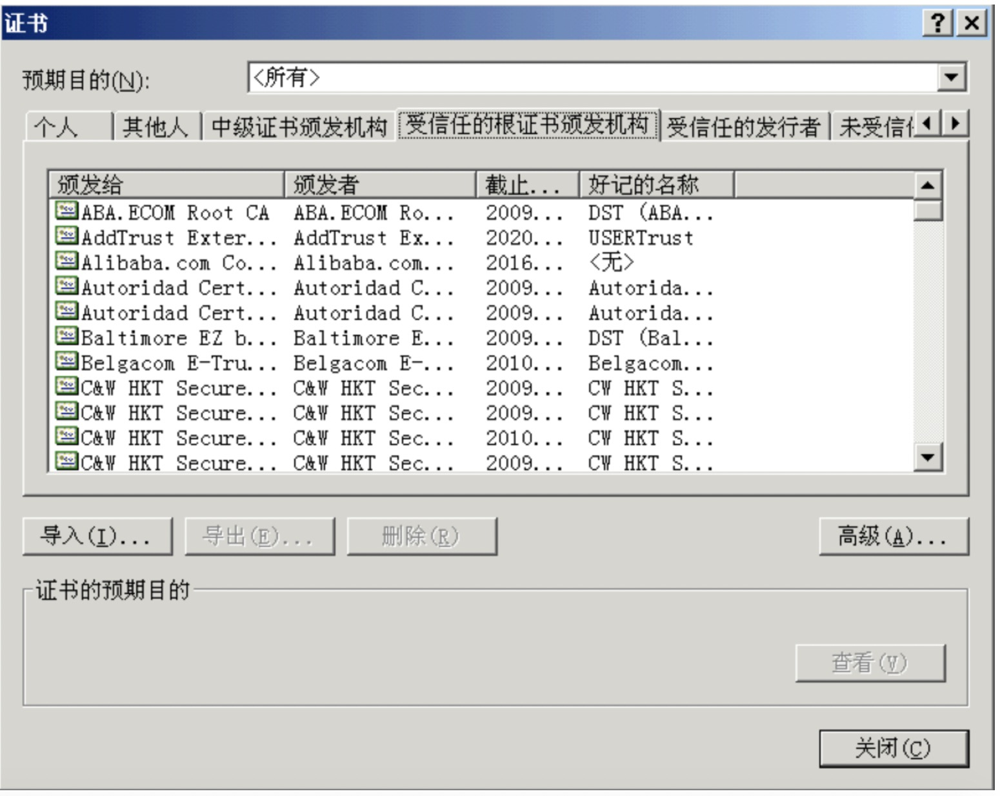
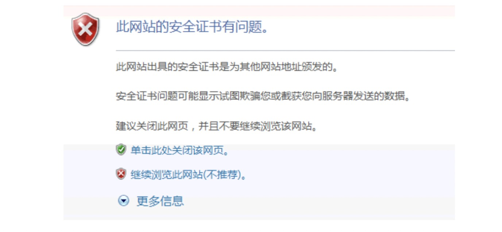
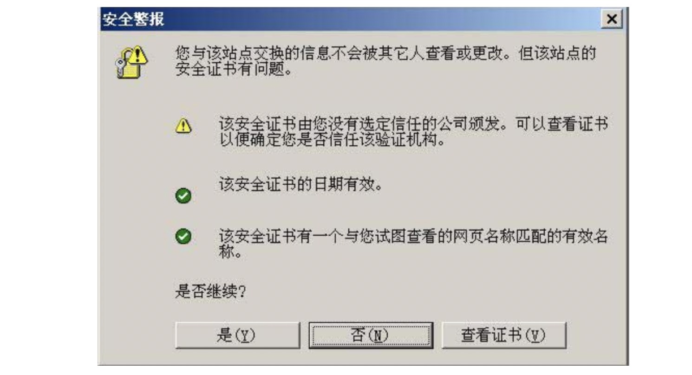
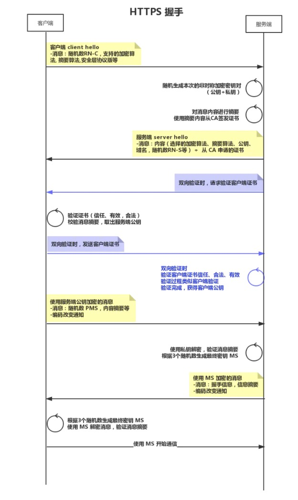
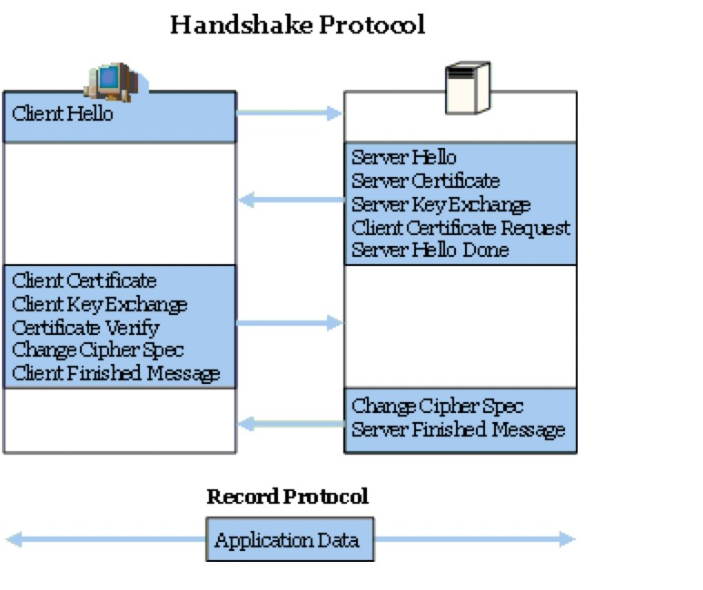

## HTTPS 详解

- HTTPS: (Hypertext transfer protocol Secure),又叫做 HTTP over TSL/SSL，使用 http 进行通信，但是使用 TSL/SSL 来进行加密。在 HTTP 和 TCP 之间增加了一层 TLS/SSL。
- TLS :(Transport Layer Security) 传输层安全协定
- SSL : (Secure Socket Layer) 安全套接层。

SSL/TLS 位于七层协议中的**会话层**，用于认证用户和服务器，加密数据以及维护数据的完整性，确保数据在传输过程中不会被修改。

SSL可以分为两层:

* SSL记录协议: 建立于可靠的传输协议，例如 TCP，为高层协议提供数据封装、压缩、加密等基本功能的支持。
* SSL 握手协议: 它建立在SSL记录协议之上，用于在实际的数据传输开始前，通讯双方进行身份认证、协商加密算法、交换加密密钥等。

#### HTTP 的不安全性

| 风险      | 描述                         | https解决方案 |
| --------- | ---------------------------- | ------------- |
| 窃听风险  | 攻击者可以获知消息内容       | 消息加密      |
| 篡改风险  | 攻击者可以篡改消息内容       | 消息摘要      |
| 冒充风险  | 攻击者可以冒充其他人参与通信 | CA 身份认证   |
| CA 不可信 | 信任的 CA 乱签发证书         | 证书锁        |

#### 窃听、嗅探问题

为了防止传输的信息被窃听，通常使用加密算法来保证信息的安全性，对称加密的方法效率高，但是对称加密的时候只使用一个公钥，但是公钥的传递可能是不安全的，如果对方截获了传递公钥的信息，那么后续的信息传送也是不安全的。

如果使用非对称的加密方式，例如 RSA，用对方的公钥加密信息，对方用自己的私钥解密消息，这样的方法比较安全，但是由于非对称加密算法 消耗大，特别是对比较大的数据，加密解密的速度会变慢很多，因此不能单一的使用非对称加密算法来加密。

因此我们可以使用对称加密和非对称加密结合的方法来传递信息。在传递对称加密的公钥的时候使用非对称加密的方式加密，在对方都成功获取到公钥之后，再使用对称加密的方式通信。这样安全又便捷。

#### 消息篡改问题

因为加密方式防止了攻击者读取自己发送的信息，但是并不能防止其修改内容，为了防止自己传输的信息被黑客拦截并且篡改，可以使用内容摘要的方法来验证数据的完整性，在发送消息的时候，通过一些 hash 的方法对将要发送的消息进行摘要。并且连同消息一起发送给接受方。接收方在收到消息之后对消息做同样的摘要处理，对比摘要的结果就知道信息是否被篡改过。

摘要常用的算法有 MD5和SHA1, 因为 hash 算法是不可逆的，因此无法逆向推出原消息的内容。

#### 冒充问题(中间人问题)

在消息传递的初期，即使是使用非对称的加密方式，也有可能出现一个中间人来拦截信息。例如 A 和 B 通信，中间有一个 C，拦截了 A 发送给 B 的请求连接信息，B 就会发送自己伪造的公钥给 A，同时给 C 发送请求，申请到 C的公钥。这样 A 和 B 之间的通信就不再安全。被完全窃听和随意修改。

出现这样的问题的原因是，密钥在交换的初期是不安全的，网络上通信的两个人，无法确定对方的身份，也无法确认当前的公钥是不是自己想要的公钥。

这种情况下就需要CA(certificate authority)来做验证，让想和自己联系的这个人去 CA 做认证，CA 会用自己的私钥，对这个人的公钥和一些相关信息进行加密，生成数字证书，之后再发送消息的时候只要连带消息，数字签名和数字证书一起发送就可以验证了。

收到数字证书后，使用 CA 公钥(比较著名的 CA 的公钥都和浏览器和操作系统合作，内嵌在浏览器、操作系统中)解开数字证书，就可以拿到对方的公钥，然后就可以验证数字签名，查看信息是否被修改了。

例如 Alice 和 Bob 通信。Bob 向 alice 发送证书。

因为 CA 加密的过程是非对称的，所以即使黑客也有 CA的公钥，可以用公钥解开看到Bob的公钥，但是黑客没有 CA 的私钥，所以无法产生对应的黑客自己的公钥的 CA 加密，所以即使修改了对方也能够察觉出异常。因此中间人修改的这个过程变得没什么意义，从而能够防护。

##### 客户端证书管理器

##### 如果证书记载网址和正在浏览的网址不同

##### 如果这个数字证书不是由受信任的机构颁发

目前因为 CA 失误导致错误签发的情况时有发生，解决方案有证书锁。

#### 安全保存 CA

从根 CA 开始到直接给客户发放证书的各层次 CA，都有其自身的密钥对。CA 中心的密钥对一般由硬件加密服务器在机器内直接产生，并存储于加密硬件内，或以一定的加密形式存放于密钥数据库内。加密备份于 IC 卡或其他存储介质中，并以高等级的物理安全措施保护起来。

密钥的销毁要以安全的密钥冲写标准，彻底清除原有的密钥痕迹。需要强调的是，根 CA 密钥的安全性至关重要，它的泄露意味着整个公钥信任体系的崩溃，所以 CA 的密钥保护必须按照最高安全级的保护方式来进行设置和管理。CA 的私钥是自己靠上述方法保管的，不对外公开。

所以 CA 密钥的安全性依赖于物理硬件的安全性，不通过网络传输避免了被攻击的可能。

CA 的公钥是厂商跟浏览器和操作系统合作，把公钥默认装到浏览器或者操作系统环境里。比如 firefox 就自己维护了一个可信任的 CA 列表，而 chrome 和 IE 使用的是操作系统的 CA 列表。

#### Https 过程

#### TLS 握手过程

1. **Client Hello** ：客户端发送表示想要初始化Session 连接

> **Client Hello**包含的字段：
>
> - SSL/TLS 版本号：version 2 表示的是SSL 2.0，version 3 表示的是SSL 3.0，version 3.1表示的是TLS 1.0。
> - 随机数Random_C：一共32个字节。前面4个字节是当前时间戳，后面28个字节是一个随机数。后面协商对称加密的Session Key会用到。
> - Session ID：如果是之前已经存在的连接重连，那么Session ID会是一串数字，否则是None。
> - Cipher Suite: 支持的组件列表（即支持的加密算法，hash 摘要算法，协议版本等等）例如TLS_RSA_WITH_DES_CBC_SHA, TLS 是TLS协议版本，TLS表示TLS1.0，RSA是密钥交换算法，DES_CBC是加密算法，SHA是摘要算法。
> - 压缩算法。表示建议选用的是哪种压缩算法。
>
> #### Client Hello 消息示例：
>
> **ClientVersion** 3,1
> **ClientRandom[32]**
> **SessionID**: None (new session)
> **Suggested Cipher Suites**:
> TLS_RSA_WITH_3DES_EDE_CBC_SHA
> TLS_RSA_WITH_DES_CBC_SHA
> **Suggested Compression Algorithm**: NONE

1. **Server Hello**: 服务器收到客户端的Client Hello 消息会先响应一个Server Hello 消息，包括以下字段：

> - SSL/TLS 版本，客户端和服务器都支持的SSL/TLS最高版本。
> - 随机数Random_S，一共32个字节，前面4个字节是当前时间戳，后面28个字节是一个随机数。后面协商对称加密的Session Key会用到。
> - Session ID，这里会有三种情况。1.产生一个新的Session ID，表示没有找到之前的Session ID或者之前没有这个Session ID。2. 返回客户端带上的之前的Session ID。（断链重连）3.Null，服务器没有办法产生新的Session ID。
> - Cipher Suite，服务器从刚才Client Hello消息的Cipher Suite加密列表中选中的加密组件。
> - 压缩算法，表示选中的是哪种压缩算法。

> #### Server Hello 消息示例：
>
> **Version** 3,1
> **ServerRandom[32]**
> **SessionID**: bd608869f0c629767ea7e3ebf7a63bdcffb0ef58b1b941e6b0c044acb6820a77
> **Use Cipher Suite**: TLS_RSA_WITH_3DES_EDE_CBC_SHA
> **Compression Algorithm**: NONE

> 如上图，在 Server hello 之后服务器还会发送其他几条信息：
>
> 1. **Server Certificate**.服务器发给客户端的证书，包含公钥。
> 2. **Server Key Exchange**.[可选]当服务器的证书不包含公钥时，客户端会用它来加密后面的Client Key Exchange消息
> 3. **Client Certificate Request**：在需要客户端证书的时候请求客户端证书（双向验证时）。
> 4. **Server Hello Done** 表示Server已经发送消息完毕并且在登陆客户端回复

1. 客户端回应消息:

> **Client Certificate**. 客户端证书(双向验证时候需要)
>
> **Client Key Exchange**：包含premaster secret,TLS的版本号。该消息字段会用公钥加密。现在一共有Random_C,Random_S, premaster secret三个随机数，客户端和服务器端会用相同的算法，用这三个随机数作为参数，从而计算得到另外的一个随机数，即后面对称加密的密钥Session Key。
>
> **Certificate Verify**.该消息只针对有Client Certificate的情况。会计算出该消息字段的HASH，然后用客户端的私钥加密该HASH作为签名。服务器端会使用Client Certificate消息中得到的客户端公钥解密并验证这条消息的合法性。

> **Change Cipher Suite**.该消息通知服务器接下来的Client Finish消息将会用刚才协商的密钥Session Key来加密 **Client Finished**.该消息会列举客户端上面用到的所有加密字段，并且算出他们的HASH值，然后用Session Key加密。

1. 服务器在握手阶段最后回应:

> **Change Cipher Suite Message**.该消息通知客户端接下来的消息会用Session Key来加密。
>
> **Sever Finished Message**. 对整个协商阶段用到的字段算一个HASH，然后用Session Key加密。