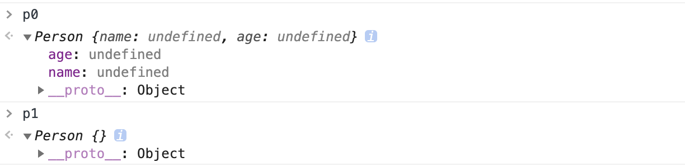

# Js函数实现

## 类型判断

```javascript
function type(target){
		return Object.prototype.toString.call(target);
}
type('1')  // [object Number]
type(true) // [object Boolean]
type([]) //[object Array]
type({}) //[object Object]

// 用箭头函数的闭包封装
const istype = type => target => `[object ${type}]` === Object.prototype.toString.call(target)
const isArray = istype('Array')
isArray([]) // true
```


## 实现 map 方法

```javascript
Array.prototype.Map = function(fn){
		let arr = Array.prototype.slice.call(this);
  	let ret = [];
  	for (let i = 0;i < arr.length; i++){
				ret[i] = fn.call(undefined, arr[i], i, arr); // 这里第一个参数为 undefined, 剩下参数和 map一样
		}
  	return ret; // 一定记得 return
}

a = [3,4,5]
a.Map((x)=>x**2) // [9,16,25]
let square = function(x){return x**2}
a.Map(square)    // [9,16,25]
```


## new & 以及和Object.create的区别

```javascript
// 手写实现new
function new_(constructor){
  	res = {};
  	res.__proto__ = constructor.prototype;
    construcotr.call(res, Array.prototype.slice.call(arguments, 1));
    return res;
}


function Person(name, age){
  	this.name = name;
  	this.age = age;
}
Person.prototype.getname = function(){
		console.log(`name == ${name}, age == ${age}`);
}
let p0 = new Person()
let p1 = Object.create(Person.prototype);
// 

```

可以看到下面的图片，因此可以得知 **create只完成了继承原型的任务，而new 则多了一个调用构造函数的过程， 如果构造函数是完全空的，那么 p0将会等于 p1**。(Object.create 实际上是创建一个prototype 指向给定参数的实例，new 中也有同样的过程, 如果把自己写的 new 函数中调用构造函数的部分去掉，则做的事情和 Object.create 一样。)



## instanceof

```javascript
function instanceof(left, right){
  	let proto = left.__proto__
    let p = right.prototype
    while (true){
      	if (proto == null) return false;
      	if (proto == p) return true;
      	proto = proto.__proto__
    }
}
```


> typeof 原理:
>
> typeof 基本可以返回正确的类型，除了 typeof null == object, typeof([]) == object
>
> typeof 的实现原理是查看底层的二进制，js 的底层二进制表示中，前三位用来表示其属于的类型。前三位都是0的就表示对象，而 null 为全0，所以返回也为对象
>
> *  000：对象
> * 1: 整数
> * 010：浮点数
> * 100：字符串
> * 110：布尔
>
> js 的 number 表示使用IEEE754 标准，采用双精度存储，占用64bit，其中1位符号位，11位指数位，52位尾数位置，当出现循环二进制，例如0.1，0 .2这样的，就会对于超出位数的精度进行截断，造成精度丢失。


## Call

```javascript
Function.prototype.myCall = function(obj){
  	obj = obj || window;
  	obj.fn = this;
  	let res = obj.fn(...Array.from(arguments).slice(1));
  	delete obj.fn;
  	return res;
}
```


## Apply

```javascript
Function.prototype.myApply = function(obj){
  	obj = obj || window;
  	obj.fn = this;
  	let res = null;
  	if (arguments.length <=1){
				res = obj.fn()
		}
  	else{
				let arg = arguments[1];
      	res = obj.fn(...arg);
		}
		delete obj.fn;
		return res;
  
}
```


## Bind

```javascript
Function.prototype.myBind = function(obj){
  	obj = obj || window;
  	obj.fn = this;
  	let arg = Array.from(arguments).slice(1);
  	return function(){
				let res = obj.fn(...arg, ...arguments);
      	delete obj.fn;
      	return res;
		}
}
```


## Flat

js本身是带有flat 这个方法的，在 Array.prototype 上

```javascript
let arr = [1, [2, 3, [4, 5, [12, 3, "zs"], 7, [8, 9, [10, 11, [1, 2, [3, 4]]]]]]];
arr.flat(Infinity)
>> [1, 2, 3, 4, 5, 12, 3, "zs", 7, 8, 9, 10, 11, 1, 2, 3, 4]
```

自己写一个

```javascript
Array.prototype.myFlat = function(){
		let res = [];
  	this.forEach(item =>{
				if (Array.isArray(item)){
						res.push(...item.myFlat())
				}else{
						res.push(item)
				}
		});
  	return res
}
```

用 reduce 实现 flat

```javascript
Array.prototype.Flat = function(){
	let arr = Array.prototype.slice.call(this);
  return arr.reduce((pre, cur)=>{
			if (Array.isArray(cur)){
					return [...pre, ...Array.prototype.Flat.call(cur)]
			}
    	else{
					return [...pre, cur]
			}
	},[]) // !!!!!注意这里的[]很重要！！
}

let a = [1,2,3,[4,5,[6,7,[8]]]]
a.Flat() //[1,2,3,4,5,6,7,8]
```


## Promise 实现的SetTimeout

```javascript
let setTout = function(time, cb){
		return new Promise((resolve, reject)=>{
					let end = new Date().getTime();
      		while (new Date().getTime() < end){}
					resolve();
		}).then(success=>{
					cb();
			})
}

setTout(3000, ()=>console.log('Timeout'));
// 3s后输出 Timeout
```


## Promise 实现 sleep

```javascript
const sleep = function(delay){
  	return new Promise((resolve, reject)=>{
				end = new Date().getTime()+delay;
      	while (new Date().getTime()< end){}
				resolve();
		})
}

async function doSomething(){
		console.log(111);
  	await sleep(5000);
  	console.log(222);
}
```


## Js 的继承

### 1. 基于原型的继承

```javascript
 function father(name){
		this.name = name;
}
father.prototype.getName = function(){
		console.log(`father name == ${this.name}`);
}
function child(name){
		this.name = name;
}
child.prototype = new father();
child.prototype.constructor = child;
child.getName = function(){
		console.log(`child name == ${this.name}`);
}
```

## 2. Es6 class 继承

```javascript
class Parent{
		constructor(name){
					this.name = name;
		}
  	sayName(){
					console.log(`this name == ${this.name}`);
		}
  	getName(){
					return this.name;
    }
}	
class child extends Parent{
		constructor(name,age){
				super(name);
      	this.age = age;
		}
  	sayAge(){
				console.log(`this age == ${this.age}`);
    }
}
```


## 函数柯里化

```javascript
const curry = function(fn){
		if (fn.length <=1) return fn // fn.length 返回的是原来函数的参数数量, 对于下面的数量就是4
  	const generator = (...args)=>{  	//产生一个 function, args 待定，这里 产生并返回的 generator, 相当于下面的 cadd
				if(args.length == fn.length){ // 如果给出的参数数量和 fn 要求数量一致，则直接返回执行 fn 的结果
							return fn(...args)
				}
      	else{
							return (...args2)=>{	// 否则的话还是返回一个 function，第一次给出的 args 和下次给出的 args2共同作为参数。
									return generator(...args, ...args2)
							}
				}
		}
    return generator
}

function add(a,b,c,d){return a+b+c+d;}

cadd = curry(add)
cadd(1)(2)(3)(4)
// 10
```


## 单例模式

所谓单例模式就是一个变量在声明之前，查看之前是否有声明过，如果声明过就使用之前的 instance，而不是重新创建，如果之前从未声明过这个 instance，那么就按照给定的条件生成。

```javascript
const singleTon = function(name){
			this.name = name;
}
singleTon.prototype.getName = function(){
			return this.name
}
singleTon.instance = null;
singleTon.getInstance = function(name){
			if (!this.instance){
					this.instance = new singleTon(name)
			}
  		return this.instance;
}
singleTon.instance //null
const aaa = singleTon.getInstance('aaa')
// singleTon {name: "aaa"}
const bbb = singleTon.getInstance('bbb')
// singleTon {name: "aaa"}
```

可以看到上面的 getInstance 在 第一次调用之前，instance 为 null，在调用之后第一次创建了一个 instance, 而后再次调用的时候返回的 instance 还是之前的那个。


## async/await 的优雅处理

```javascript
async function errorCaptured(asyncFun){
	try{
			let res = await asyncFun()
      return [null, res]
	}catch(e){
			return [e, null]
	}
}

let [err, res] = await errorCaptured(asyncFun)
```


## eventEmitter

```javascript
function eventEmitter(){
		this.subs = {}
}
eventEmitter.prototype.$on = function(event, cb){
		(this.subs[event] || (this.subs[event] = [])).push(cb)
}
eventEmitter.prototype.$trigger = function(event, ...args){
		this.subs[event] && this.subs[event].forEach(cb =>{
				cb(...args);
		})
}
eventEmitter.prototype.$off = function(event, offcb){ //这里的参数 offcb 一定要是原来那个添加进来的函数，定义相同的函数不行
		if (this.subs[event]){
				let index = this.subs[event].findIndex((cb)=>cb === offcb)
        this.subs[event].splice(index,1)
      	if (!this.subs[event].length) delete this.subs[event]
		}
}

eventEmitter.prototype.$once = function(event, onceCb){
  	let _this = this; // 注意这里，自己 de了个bug..下面那个 this 如果不保存的话指向的是下面那个 function的 this
		const cb = function(...args){ // 相当于把 onceCb 封装了一下，然后对这个 function 订阅，然后在订阅之后从订阅列表中移除。
				onceCb(...args);
      	_this.$off(event, cb)
		}
    this.$on(event, cb)
}
```


## 函数去重

### 普通函数去重

```javascript
b = [1,2,3,4,3,2,5,1,6,7,7,8]
const dedup = arr =>[...new Set(arr)]
```

## 不用 set 去重(indexOf)

```javascript
const dedup = arr=>{
    let res=[];
    arr.forEach(item=>{
        if(res.indexOf(item)==-1) res.push(item)
    })
    return res;
}
```

## 不用 set 去重(includes)

```javascript
const dedup = arr =>{
		let res= [];
  	arr.forEach(item=>{
				if(!res.includes(item)) res.push(item)
		})
		return res;
}
```

## 不用 set 去重(filter)

```javascript
const dedup = arr => arr.filter((item, index)=>arr.indexOf(item) == index)
```

## 不用 set去重(filter + reduce)

```javascript
const dedup = arr =>arr.reduce((pre,cur)=>pre.includes(cur)?pre:[...pre, cur],[])
```

## 复杂数组去重

```javascript
a = [1,2,3,2,3,1,4,5,[5,6],[5,6],[1,2],{key:11}, {key:11},{key2:22}]
const dedup = arr =>{
		let map = new Map()
    arr.forEach(item=>{
				map.set(JSON.stringify(item), true)
		})
		return Array.from(map.keys()).map(item=>JSON.parse(item))
}
```


## 实现 Promise.all

```javascript
Promise.All = function(promises){
  	let res = [];
  	let len = promises.length;
		return new Promise((resolve, reject)=>{
      	for(let i = 0;i<len; i++){
						Promise.resolve(promises[i]).then(data=>{
								 res.push(data);
								 if(res.length == len) resolve(res) 
						}, err=>reject(err))
				}
    })
}

var promise1 = Promise.resolve(3);
var promise2 = 42;
var promise3 = new Promise(function(resolve, reject) {
  setTimeout(resolve, 100, 'foo');
});

Promise.All([promise1, promise2, promise3]).then(data=>{console.log(data)})
```

## 实现Promise.race

```javascript
Promise.Race = function(promises){
		return new Promise((resolve, reject)=>{
				for(let i = 0; i< promises.length; i++){
						Promise.resolve(promises[i]).then(res=>{
									resolve(res);
						}, err=>reject(err))
				}
		});
}

var promise1 = new Promise(function(resolve, reject) {
    setTimeout(resolve, 500, 'one');
});

var promise2 = new Promise(function(resolve, reject) {
    setTimeout(resolve, 100, 'two');
});

Promise.Race([promise1, promise2]).then(function(value) {
  console.log(value);
});
```

## Js 快排1

```javascript
let a = [28,1,14,7,5,38,21,9,42,74,21,10,24,6,77,19];
const quickSort = function(arr){
  if (arr.length<=1) return arr;
  let [left,right,pivot] = [[],[],arr[0]]
  arr.slice(1).map(item=>item>pivot?right.push(item):left.push(item))
  return [...quickSort(left), pivot, ...quickSort(right)]
}
quickSort(a)
//[1, 5, 6, 7, 9, 10, 14, 19, 21, 21, 24, 28, 38, 42, 74, 77]
```

## Js 快排

```javascript
let a = [28,1,14,7,5,38,21,9,42,74,21,10,24,6,77,19];
const quickSort = function(arr, start, end){
    if (start>=end) return;
    let [l,r] = [start,end];
    while(l<r){
        while(l<r && arr[r]>=arr[start]) r--; // 注意这里是先 r--再 l++， 注意这里是 start 不是0， 注意这里是>=不是>
        while(l<r && arr[l]<=arr[start]) l++;
        [arr[l],arr[r]] = [arr[r], arr[l]];
    }
    [arr[l],arr[start]] = [arr[start],arr[l]];
    quickSort(arr, start,l-1);
    quickSort(arr, l+1, end);
}
quickSort(a, 0, 15);
//[1, 5, 6, 7, 9, 10, 14, 19, 21, 21, 24, 28, 38, 42, 74, 77]
```


参考:

1. [js 继承实现之Object.create](https://segmentfault.com/a/1190000014592412?utm_source=channel-hottest)

2. [一个合格的中级前端工程师需要掌握的 28 个 JavaScript 技巧](https://juejin.im/post/6844903856489365518#heading-22)

