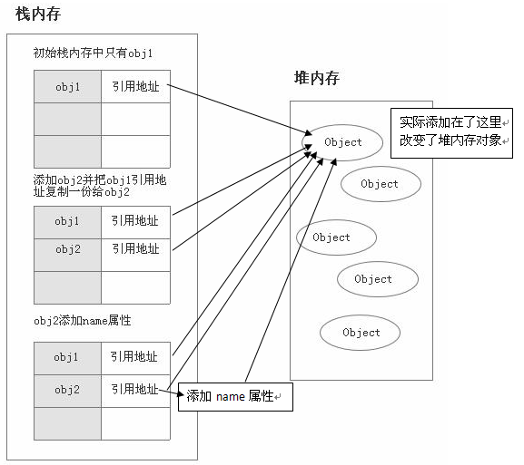

# Js基本数据类型和引用类型 & 深拷贝浅拷贝

## 基本数据类型

js 有两种数据类型：

* 基本数值类型(包含 **String**,  **Number**, **Boolean**, **Synbol**, **Null**, **Undefined**) 这些是可以直接保存在变量中的实际值。
* 引用数据类型(Object, 除了基本数据类型之外，**Array**， **function**，**正则**都属于Object)

### 基本数据的存储：

```javascript
var a = 10;
var b = a;
b = 20;
console.log(a); // 10值
console.log(b); // 20值
```


可以看到对于基本数据类型，都是在stack 中直接开辟内存，然后赋值，所有值都是直接保存在 stack 中的。

### 引用数据类型的存储

引用数据类型，即 Object 这种类型的数据，和 C 语言中一样，基本数据存放在 Stack 中，结构体开辟的空间一般要自己 malloc，并且大小不固定，这种数据一般是存放在 heap空间 中的的。在 Stack 空间中只存放heap 空间中的地址。

```javascript
var obj1 = new Object();

var obj2 = obj1;

obj2.name = "我有名字了";

console.log(obj1.name); // 我有名字了
```


从上面可以看出，两个变量指向了同一个变量，实际上 obj2 = obj1只是对 obj1的引用进行了复制并且赋值，但是实际上他们共同指向了同一个 heap 中的对象，所以修改了 obj2的指向对象的值，同时也是 obj1指向的对象，因此用 obj1也可以访问到。存储结构如下图：



```javascript
var a = [1,2,3,4,5]
b = a
c = a[0]
1
a[0] = 9

console.log(a)
>>> [9, 2, 3, 4, 5]
console.log(b)
>>> [9, 2, 3, 4, 5]
console.log(c)
>>> 1
```

可以看到上面代码初始化 a 为 指向一个数组引用，把其引用也赋值给了 b，于是修改 a 指向的数据的时候，b 也会发生改变，但是 c 赋值的是一个基本类型的数据，所以 c 的值是存在 stack 中的，而不是引用类型，所以不会发生改变。


## 浅拷贝


浅拷贝的情况如上图，可以看到 b 为 a 的复制，b 只复制了 a 的key，但是指向的值还是同样的，这样就会存在，如果 b 的 key 增加一个，a 的 key 不会增加，但是 b 对原始 key 指向的数据改动，那么 a 的数据也会改变，即父子对象之间产生了关联。

```javascript
var a = {key1: '11111'}
function copy(ele){
  	c = {}
    for (let item in ele){
        c[i] = ele[i]
    }
  	return c
}
a.key2 = [22222]
b = copy(a)
console.log(b.key1)
>>> 11111
console.log(b.key2)
>>> [22222]
b.key3 = '33333'
console.log(a.key3)
>>> undefined
b.key2.push('new')
console.log(a.key2)
>>> [22222,'new']
```

可以看到上面修改了 b 的 key2指向的值，a key2指向的值也变了，所以他们指向的还是同一个值，只不过 key 的空间分成了两个。因此任意 a 或者 b 增加 key 或者减少 key 对于另一方不会影响，但是修改原始key指向的值，就都会发生变化。 


## 深拷贝


```javascript
var a = {key:'111'}
function deepcopy(ele, c){
	c = c || {}
  for (let i in ele){
    if (typeof(ele[i]) == 'object'){
      c[i] = (ele[i].constructor === Array)?[]:{}
      deepcopy(ele[i],c[i])
    }
    else{
      c[i] = ele[i]
    }
  }
  
}
a.key2 = [111]
b = deepcopy(a)
b.key2.push(222)
console.log(b.key2)
>>> [111,222]
console.log(a.key2)
>>> [111]
```

我们不希望父对象和子对象还有关系，因此可以递归拷贝所有属于 object 的value

[参考原文](cnblogs.com/huangshikun/p/6510482.html)

