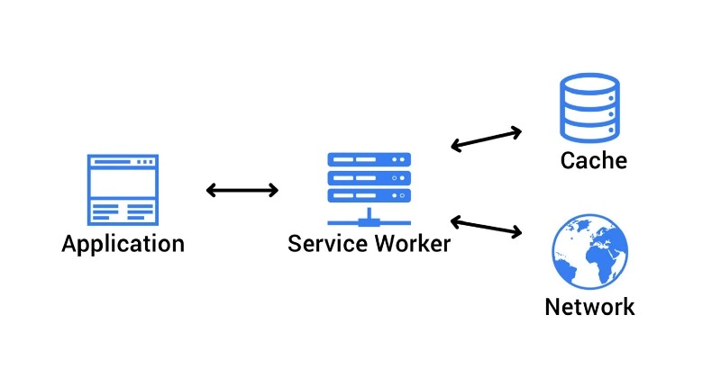

# PWA和 service worker

## PWA

**渐进式网页应用**，简称 PWA



PWA 相比原生应用更小更快，甚至不需要安装，能够自适应各种设备尺寸，并且可以脱机或者在低 internet 下工作，并且只支持https。PWA 的方法源于 webworker，顾名思义，相当于是给 web 应用注册了一个服务员。而实际场景下，我们大部分是不需要这个服务员的，例如 http 请求，资源加载等等，浏览器就可以完全胜任。

但是在某些特殊情况下， 例如离线情况，或者消息推送，传统的网页和浏览器是无法做到的。

## Service worker

Service Worker是 Web worker 的一种，他独立于浏览器进程，是一个单独的线程，在自己的全局上下文中运行(self)，它没有绑定到特定的网页，并且不能访问 dom和 window 对象。

在 Service worker 中，大量使用了 promise，因为很多功能需要等待相应之后继续。并根据响应返回一个成功或者失败的操作

下面是一段简单的 service worker 注册流程

```javascript
<script src="./static/jquery.min.js"></script>
<script>
if ('serviceWorker' in navigator) {
    $('#isSupport').text('支持');

    // 开始注册service workers
    navigator.serviceWorker.register('./sw-demo-cache.js', {
        scope: './'
    }).then(function (registration) {
        $('#isSuccess').text('注册成功');

        var serviceWorker;
        if (registration.installing) {
            serviceWorker = registration.installing;
            $('#state').text('installing');
        } else if (registration.waiting) {
            serviceWorker = registration.waiting;
            $('#state').text('waiting');
        } else if (registration.active) {
            serviceWorker = registration.active;
            $('#state').text('active');
        }
        if (serviceWorker) {
            $('#swState').text(serviceWorker.state);
            serviceWorker.addEventListener('statechange', function (e) {
                $('#swState').append('&emsp;状态变化为' + e.target.state);
            });
        }
    }).catch (function (error) {
        $('#isSuccess').text('注册没有成功');
    });
} else {
    $('#isSupport').text('不支持');
}
</script>
```

常见套路就是给 serviceworker(或者 self)添加 eventListener来检测 service worker 的安装和激活状态。

## Cache Storage

`CacheStorage`是浏览器中的一种存储机制，用于存储和检索网络请求和响应。它以`Request` 为`key`，`Response`为`value`去存储请求和响应对象。

`CacheStorage`不是`Service Worker API`，但它使SW能够**缓存网络响应，以便在用户断开与网络的连接时提供脱机功能**。

可以使用全局的 cashes 属性直接访问cacheStorage。

`Cache`和`CacheStorage`的出现让浏览器的缓存类型又多了一个：之前有memoryCache和diskCache，现在又多了个ServiceWorker cache。


参考：

1. [借助Service Worker和cacheStorage缓存及离线开发](https://www.zhangxinxu.com/wordpress/2017/07/service-worker-cachestorage-offline-develop/)

2. [译面试官：请你实现一个PWA 我](https://juejin.im/post/6844904052166230030#heading-24)

3. [JavaScript 是如何工作的：Service Worker 的生命周期及使用场景 ](https://github.com/qq449245884/xiaozhi/issues/8)