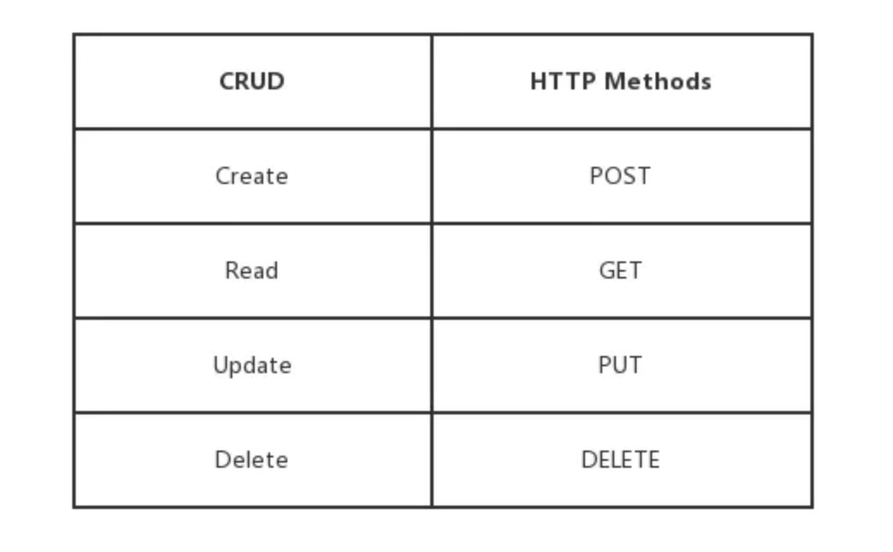
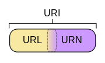

# Restful API

Rest, 全称为Representational State Transfer，表述性状态转移。

Rest 技术并没有创造新的技术，组件或者服务，而是更好的使用Web 标准中的一些准则和约束，虽然 Rest 受到Web 影响很深，但是理论上 Rest 风格并不是绑定在 HTTP 上的，但是目前 HTTP 是唯一和 Rest 相关的实例。

Rest 的原则和规范：

1. 资源： 首先明确资源只是网络上的一个实体，可以是文本，音频，视频等等，而要让一个资源可以被识别，需要一个唯一标识，在 web 中，这个标识就是 URI(uniform resource identifier), 即独特资源标识符，URI 设计需要**遵循可寻址性原则，具有自描述性，需要在形式上给人以直觉上的关联**。
   * 使用_或-来让URI可读性更好
   * 使用/来表示资源的层级关系
   * 使用?用来过滤资源
   * ,或;可以用来表示同级资源的关系
2. 统一接口： 接口名称相同，不同的HTTP方法，对应不同的 CRUD 操作

> 例如: 
>
> - GET /zoos：列出所有动物园
> - POST /zoos：新建一个动物园
> - GET /zoos/ID：获取某个指定动物园的信息
> - PUT /zoos/ID：更新某个指定动物园的信息（提供该动物园的全部信息）
> - PATCH /zoos/ID：更新某个指定动物园的信息（提供该动物园的部分信息）
> - DELETE /zoos/ID：删除某个动物园
> - GET /zoos/ID/animals：列出某个指定动物园的所有动物
> - DELETE /zoos/ID/animals/ID：删除某个指定动物园的指定动物

在 GET，POST，PUT，DELETE 中，**PUT 是不幂等**，其他的都是幂等的，**幂等与否的定义是多次操作是否会产生不同结果**

3. URL(统一资源定位符号)，只是 URI 的子集。**URL 特指使用路径来标识资源，一般包含4个部分： 协议，主机，端口，路径**:

> **protocol :// hostname[:port] / path / [;parameters][?query]#fragment**

URI 包含 URL，可以认为 URI是 URL 和 URN 两者兼备。

**URL** 的存在目的是为了在网络中**快速定位**这个文件，而 **URI**的目的则是一种标识，要考虑如何标识，然后确定一个唯一名称。而 URL 属于 URI 的一种，因为 URL 是用位置信息来标识一个文件的。同时还有一个规则，即URL中只能有名词，不能出现动词。

4. 状态码：服务器向用户返回一些状态码和提示信息，例如：

> 200 OK - [GET]：服务器成功返回用户请求的数据，该操作是幂等的（Idempotent）。
>
> 400 INVALID REQUEST - [POST/PUT/PATCH]：用户发出的请求有错误，服务器没有进行新建或修改数据的操作，该操作是幂等的。
>
> 401 Unauthorized - [*]：表示用户没有权限（令牌、用户名、密码错误）。
>
> 403 Forbidden - [*] 表示用户得到授权（与401错误相对），但是访问是被禁止的。
>
> 404 NOT FOUND - [*]：用户发出的请求针对的是不存在的记录，服务器没有进行操作，该操作是幂等的。
>
> 500 INTERNAL SERVER ERROR - [*]：服务器发生错误，用户将无法判断发出的请求是否成功。

5. 无状态

即服务器不保留客户端的状态，所有的状态维持等等情况都需要在前端独立完成。

6. 过滤信息

当记录过多的时候，不能全部返回给用户，API 应该适量提供参数，返回过滤后的结果。

> - ?limit=10：指定返回记录的数量
> - ?offset=10：指定返回记录的开始位置。
> - ?page=2&per_page=100：指定第几页，以及每页的记录数。
> - ?sortby=name&order=asc：指定返回结果按照哪个属性排序，以及排序顺序。
> - ?animal_type_id=1：指定筛选条件

