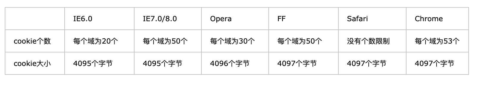
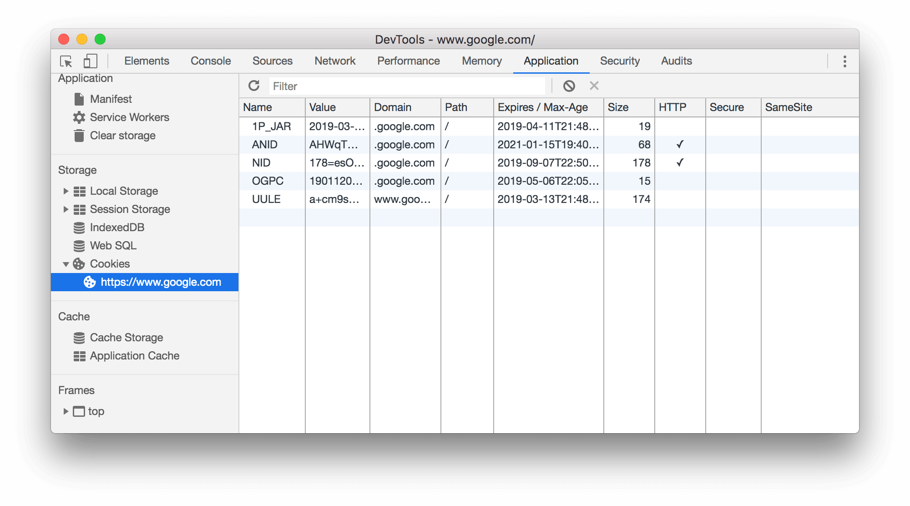

# Cookie

不同浏览器对于 cookie 的限制，可以看到大多数浏览器限制 cookie 数量为50个，一个 domain 下**总大小**不超过4KB，如果超过了这个4KB 的限制，那么新创建的 cookie 会导致老的 cookie 自动丢失。



## Cookie 的一些属性



可以看到上图显示了 cookie 的各个属性：

* name：一个 cookie 字段的名称
* value：一个 cookie 字段的值
* domain: 字段为可以访问此cookie的域名。非顶级域名，如二级域名和三级域名，设置的cookie的domain只能为顶级域名或者二级域名或者三级域名本身，不能设置其他二级域名的cookie，否则cookie无法生成。如果想要其他二级域名访问这个 cookie，则需要设置domain 为顶级域名，例如 google.com，才能够读取。
* path: 表示可以读取该 cookie 的页面的路径，例如 google.com/test，则只有 test路径下的页面才能读取这个 cookie
* Expire/max-age: 设置 cookie 的消失时间，默认是 session时间， 即关闭浏览器就消失
* Size: 此 cookie 字段大小
* httponly: 设置此 cookie 为 httponly，则只有 http(浏览器)可以对 cookie 进行操作，js和 applet 不能操作 cookie。
* secure：是否通过 https来传递此 cookie，如果为 true 的话则只在 https 下才传递此 cookie，http 下不携带 cookie，防止被窃取。

## Cookie 的操作

cookie 的存储方式都是字符串形式，里面按照下面的方式存储，键值对的形式，按照分号隔开的。

```javascript
"key1=value1; key2=value2; key3=value3"
// 设置 cookie 可以
document.cookie = 'id='+value
document.cookie="key=value;expires=失效时间;path=路径;domain=域名;secure;(secure表安全级别）
```

取出 cookie

```javascript
let cookie = Object.fromEntries(document.cookie.split(';').map(x=>x.split('=')));
// 需要加一个 decodeURIComponent 来进行转义
// 返回字典形式的 cookie
```

设置 cookie

```javascript
let cookie = encodeURIComponent(key) + "=" + encodeURIComponent(value);
cookie += ";expires="+ "一个 GMT 日期"
cookie += ";domain=" + "domain的位置例如 www.google.com"
cookie += ";path=" + "/test"
cookie += ";http=" + "true/false" // 表示是否 httponly
cookie += ";secure=" + "true/false" // 表示是否只在 https 下使用
document.cookie = cookie
```

注意这里的 encodeURIComponent, 是用来解码的，一般存放到 cookie 中的 key 和 value 都要转义，从 cookie 中读出来的时候再用 decodeURIComponent 进行转义回去。