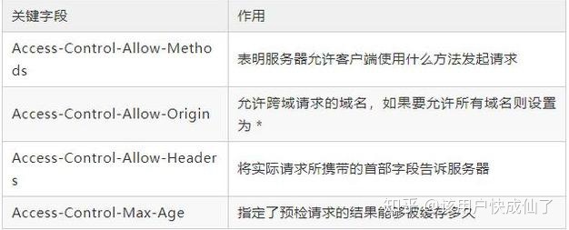

# Options请求

HTTP 的 OPTIONS 方法 用于获取目的资源所**支持的通信选项**。客户端可以对指定 url 发起，也可以对整站发起(url 设置为'*')。

简而言之，options 请求就是用于请求对于某些接口等资源的支持情况的，例如请求方法，content-type, 是否允许跨域等等。在**跨域请求中经常发起(简单请求不会发起，复杂请求才会)**。

## 浏览器发起的请求

### 简单请求

- 请求方法为GET、HEAD、POST时发的请求
- 人为设置了规范集合之内的首部字段，如Accept/Accept-Language/Content-Language/Content-Type/DPR/Downlink/Save-Data/Viewport-Width/Width
- Content-Type 的值仅限于下列三者之一,即application/x-www-form-urlencoded、multipart/form-data、text/plain
- 请求中任意 XMLHttpRequestUpload 对象均没有注册任何事件监听器；
- 请求中没有使用 ReadableStream 对象。

### 复杂请求

- 使用了下面任一 HTTP 方法，PUT/DELETE/CONNECT/OPTIONS/TRACE/PATCH
- 人为设置了以下集合之外首部字段，即简单请求外的字段
- Content-Type 的值不属于下列之一，即application/x-www-form-urlencoded、multipart/form-data、text/plain

### Request header 关键字段

### Options 请求优化

从上面的描述中可以看出，一但触发了这个机制，就会导致多发一次请求。即如果是复杂请求，就会先发出 options 请求，用于确认目标资源是否支持跨域，然后浏览器根据相应的 header自动处理剩余的请求。**如果支持跨域则继续发出请求，如果不支持则在控制台显示错误**。

为了优化多一次 options 请求这个问题；我们可以：

1. 转为简单请求，如用 JSONP 做跨域请求
2. 服务器端设置 Access-Control-max-age字段，当第一次请求的时候发送 options 请求，在 max-age 时间之内不会触发options 请求。但是需要在设置界面去掉 disable cache 的配置。