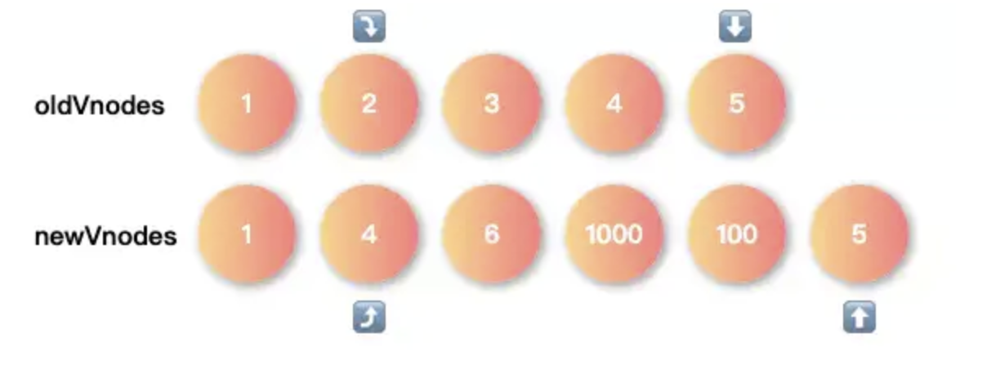

# Vnode 和 diff 算法

## 什么是 virtual dom

Virtual DOM是对DOM的抽象,本质上是JavaScript对象,这个对象就是更加**轻量级的对DOM的描述**.


## Why virtual dom

1. dom 元素本身相当复杂，对 dom 的操作很费时间, 下面遍历 dom 属性可以看到属性特别多和繁琐。

```javascript
let span = document.createElement('span')
let str = ''
for (let i in span){str+= i+' '} // 遍历用字符串输出所有属性(只是一级属性，甚至不包括子属性)
//"title lang translate dir hidden accessKey draggable spellcheck autocapitalize contentEditable isContentEditable inputMode offsetParent offsetTop offsetLeft offsetWidth offsetHeight style innerText outerText oncopy oncut onpaste onabort onblur oncancel oncanplay oncanplaythrough onchange onclick onclose oncontextmenu oncuechange ondblclick ondrag ondragend ondragenter ondragleave ondragover ondragstart ondrop ondurationchange onemptied onended onerror onfocus onformdata oninput oninvalid onkeydown onkeypress onkeyup onload onloadeddata onloadedmetadata onloadstart onmousedown onmouseenter onmouseleave onmousemove onmouseout onmouseover onmouseup onmousewheel onpause onplay onplaying onprogress onratechange onreset onresize onscroll onseeked onseeking onselect onstalled onsubmit onsuspend ontimeupdate ontoggle onvolumechange onwaiting onwebkitanimationend onwebkitanimationiteration onwebkitanimationstart onwebkittransitionend onwheel onauxclick ongotpointercapture onlostpointercapture onpointerdown onpointermove onpointerup onpointercancel onpointerover onpointerout onpointerenter onpointerleave onselectstart onselectionchange onanimationend onanimationiteration onanimationstart ontransitionend dataset nonce autofocus tabIndex click attachInternals focus blur enterKeyHint onpointerrawupdate namespaceURI prefix localName tagName id className classList slot attributes shadowRoot part assignedSlot innerHTML outerHTML scrollTop scrollLeft scrollWidth scrollHeight clientTop clientLeft clientWidth clientHeight attributeStyleMap onbeforecopy onbeforecut onbeforepaste onsearch elementTiming previousElementSibling nextElementSibling children firstElementChild lastElementChild childElementCount onfullscreenchange onfullscreenerror onwebkitfullscreenchange onwebkitfullscreenerror hasAttributes getAttributeNames getAttribute getAttributeNS setAttribute setAttributeNS removeAttribute removeAttributeNS toggleAttribute hasAttribute hasAttributeNS getAttributeNode getAttributeNodeNS setAttributeNode setAttributeNodeNS removeAttributeNode attachShadow closest matches webkitMatchesSelector getElementsByTagName getElementsByTagNameNS getElementsByClassName insertAdjacentElement insertAdjacentText setPointerCapture releasePointerCapture hasPointerCapture insertAdjacentHTML requestPointerLock getClientRects getBoundingClientRect scrollIntoView scroll scrollTo scrollBy scrollIntoViewIfNeeded animate computedStyleMap before after replaceWith remove prepend append querySelector querySelectorAll requestFullscreen webkitRequestFullScreen webkitRequestFullscreen onbeforexrselect ariaAtomic ariaAutoComplete ariaBusy ariaChecked ariaColCount ariaColIndex ariaColSpan ariaCurrent ariaDisabled ariaExpanded ariaHasPopup ariaHidden ariaKeyShortcuts ariaLabel ariaLevel ariaLive ariaModal ariaMultiLine ariaMultiSelectable ariaOrientation ariaPlaceholder ariaPosInSet ariaPressed ariaReadOnly ariaRelevant ariaRequired ariaRoleDescription ariaRowCount ariaRowIndex ariaRowSpan ariaSelected ariaSetSize ariaSort ariaValueMax ariaValueMin ariaValueNow ariaValueText ariaDescription getAnimations ELEMENT_NODE ATTRIBUTE_NODE TEXT_NODE CDATA_SECTION_NODE ENTITY_REFERENCE_NODE ENTITY_NODE PROCESSING_INSTRUCTION_NODE COMMENT_NODE DOCUMENT_NODE DOCUMENT_TYPE_NODE DOCUMENT_FRAGMENT_NODE NOTATION_NODE DOCUMENT_POSITION_DISCONNECTED DOCUMENT_POSITION_PRECEDING DOCUMENT_POSITION_FOLLOWING DOCUMENT_POSITION_CONTAINS DOCUMENT_POSITION_CONTAINED_BY DOCUMENT_POSITION_IMPLEMENTATION_SPECIFIC nodeType nodeName baseURI isConnected ownerDocument parentNode parentElement childNodes firstChild lastChild previousSibling nextSibling nodeValue textContent hasChildNodes getRootNode normalize cloneNode isEqualNode isSameNode compareDocumentPosition contains lookupPrefix lookupNamespaceURI isDefaultNamespace insertBefore appendChild replaceChild removeChild addEventListener removeEventListener dispatchEvent "

```


2. 前端性能优化的一点就是尽可能少的操作 dom，不仅仅是因为本身的 dom 元素相当复杂，更因为 dom 操作可能会导致频繁的回流和重绘，因此我们需要这一层抽象的 Vnode，让 dom 操作尽可能的一次性更新到 dom 中，这样保证了DOM不会出现性能很差的情况.

   现代前端框架的一个基本要求就是无须手动操作DOM,一方面是因为手动操作DOM无法保证程序性能,多人协作的项目中如果review不严格,可能会有开发者写出性能较低的代码,另一方面更重要的是省略手动DOM操作可以大大提高开发效率.


## Virtual DOM创建

知道了 virtual dom 只是对真实 dom 的抽象之后，我们可以对 dom 元素进行不同程度的抽象，如最简单的抽象

```javascript
 var vnode = {
  type, // String，DOM 节点的类型，如 'div'
  data, // Object，包括 props，style等等 DOM 节点的各种属性
  children // Array，子节点
}
```

明确了一个vnode 是什么样子以后，我们就可以写一个函数来创建 virtual dom

```javascript
function vnode(type, key, data, children, text, elm) {
  const element = {
    __type: VNODE_TYPE,
    type, key, data, children, text, elm
  }

  return element
}
```

上面的这个 vnode函数接收一些参数，返回一个 object，这个 object 就是对于 dom 的抽象


## Virtual dom tree 的构建

上面的函数实现了单个 vnode 的创建，但是dom 结构实际上是一个 tree，因此我们需要实现一个函数，使得其可以构建一个 virtual dom tree(vnode tree)

```javascript
function h(type, config, ...children) {
  const props = {}

  let key = null

  // 获取 key，填充 props 对象
  if (config != null) {
    if (hasValidKey(config)) {
      key = '' + config.key
    }

    for (let propName in config) {
      if (hasOwnProperty.call(config, propName) && !RESERVED_PROPS[propName]) {
        props[propName] = config[propName]
      }
    }
  }

  return vnode(
    type,
    key,
    props,
    flattenArray(children).map(c => {
      return isPrimitive(c) ? vnode(undefined, undefined, undefined, undefined, c) : c
    })
  )
}

```

上面的这个 h 函数可以返回一个 vnode tree


## Virtual node tree 转化为真实dom

```javascript
function createElm(vnode, insertedVnodeQueue) {
  let data = vnode.data
  let i
  // 省略 hook 调用
  let children = vnode.children
  let type = vnode.type

  /// 根据 type 来分别生成 DOM
  // 处理 comment
  if (type === 'comment') {
    if (vnode.text == null) {
      vnode.text = ''
    }
    vnode.elm = api.createComment(vnode.text)
  }
  // 处理其它 type
  else if (type) {
    const elm = vnode.elm = data.ns
      ? api.createElementNS(data.ns, type)
      : api.createElement(type)

    // 调用 create hook
    for (let i = 0; i < cbs.create.length; ++i) cbs.create[i](emptyNode, vnode)

    // 分别处理 children 和 text。
    // 这里隐含一个逻辑：vnode 的 children 和 text 不会／应该同时存在。
    if (isArray(children)) {
      // 递归 children，保证 vnode tree 中每个 vnode 都有自己对应的 dom；
      // 即构建 vnode tree 对应的 dom tree。
      children.forEach(ch => {
        ch && api.appendChild(elm, createElm(ch, insertedVnodeQueue))
      })
    }
    else if (isPrimitive(vnode.text)) {
      api.appendChild(elm, api.createTextNode(vnode.text))
    }
    // 调用 create hook；为 insert hook 填充 insertedVnodeQueue。
    i = vnode.data.hook
    if (i) {
      i.create && i.create(emptyNode, vnode)
      i.insert && insertedVnodeQueue.push(vnode)
    }
  }
  // 处理 text（text的 type 是空）
  else {
    vnode.elm = api.createTextNode(vnode.text)
  }

  return vnode.elm
}

```

上面这个函数很简单，就是根据 vnode 的 type 生成不同的节点，并且赋予其不同的 attribute。

## Virtual dom diff

这个函数也是最难的地方，即找出新旧 virtual dom 的差异以便更新。可见 diff 算法是直接影响Virtual DOM 性能的关键部分.

理论上要比较两个 vnode树的差异，时间复杂度可达到$O(n^3)$, 但是在实际开发中，我们很少会遇到跨层级的DOM 变更，并且现代的各种 virtual dom 库一般都是同级比较差异，这种情况我们的时间复杂度是$O(n)$

```javascript
// 遍历 oldCh 和 newCh 来比较和更新
    while (oldStartIdx <= oldEndIdx && newStartIdx <= newEndIdx) {
      // 1⃣️ 首先检查 4 种情况，保证 oldStart/oldEnd/newStart/newEnd
      // 这 4 个 vnode 非空，左侧的 vnode 为空就右移下标，右侧的 vnode 为空就左移 下标。
      if (oldStartVnode == null) {
        oldStartVnode = oldCh[++oldStartIdx]
      } else if (oldEndVnode == null) {
        oldEndVnode = oldCh[--oldEndIdx]
      } else if (newStartVnode == null) {
        newStartVnode = newCh[++newStartIdx]
      } else if (newEndVnode == null) {
        newEndVnode = newCh[--newEndIdx]
      }
      /**
       * 2⃣️ 然后 oldStartVnode/oldEndVnode/newStartVnode/newEndVnode 两两比较，
       * 对有相同 vnode 的 4 种情况执行对应的 patch 逻辑。
       * - 如果同 start 或同 end 的两个 vnode 是相同的（情况 1 和 2），
       *   说明不用移动实际 dom，直接更新 dom 属性／children 即可；
       * - 如果 start 和 end 两个 vnode 相同（情况 3 和 4），
       *   那说明发生了 vnode 的移动，同理我们也要移动 dom。
       */
      // 1. 如果 oldStartVnode 和 newStartVnode 相同（key相同），执行 patch
      else if (isSameVnode(oldStartVnode, newStartVnode)) {
        // 不需要移动 dom
        patchVnode(oldStartVnode, newStartVnode, insertedVnodeQueue)
        oldStartVnode = oldCh[++oldStartIdx]
        newStartVnode = newCh[++newStartIdx]
      }
      // 2. 如果 oldEndVnode 和 newEndVnode 相同，执行 patch
      else if (isSameVnode(oldEndVnode, newEndVnode)) {
        // 不需要移动 dom
        patchVnode(oldEndVnode, newEndVnode, insertedVnodeQueue)
        oldEndVnode = oldCh[--oldEndIdx]
        newEndVnode = newCh[--newEndIdx]
      }
      // 3. 如果 oldStartVnode 和 newEndVnode 相同，执行 patch
      else if (isSameVnode(oldStartVnode, newEndVnode)) {
        patchVnode(oldStartVnode, newEndVnode, insertedVnodeQueue)
        // 把获得更新后的 (oldStartVnode/newEndVnode) 的 dom 右移，移动到
        // oldEndVnode 对应的 dom 的右边。为什么这么右移？
        // （1）oldStartVnode 和 newEndVnode 相同，显然是 vnode 右移了。
        // （2）若 while 循环刚开始，那移到 oldEndVnode.elm 右边就是最右边，是合理的；
        // （3）若循环不是刚开始，因为比较过程是两头向中间，那么两头的 dom 的位置已经是
        //     合理的了，移动到 oldEndVnode.elm 右边是正确的位置；
        // （4）记住，oldVnode 和 vnode 是相同的才 patch，且 oldVnode 自己对应的 dom
        //     总是已经存在的，vnode 的 dom 是不存在的，直接复用 oldVnode 对应的 dom。
        api.insertBefore(parentElm, oldStartVnode.elm, api.nextSibling(oldEndVnode.elm))
        oldStartVnode = oldCh[++oldStartIdx]
        newEndVnode = newCh[--newEndIdx]
      }
      // 4. 如果 oldEndVnode 和 newStartVnode 相同，执行 patch
      else if (isSameVnode(oldEndVnode, newStartVnode)) {
        patchVnode(oldEndVnode, newStartVnode, insertedVnodeQueue)
        // 这里是左移更新后的 dom，原因参考上面的右移。
        api.insertBefore(parentElm, oldEndVnode.elm, oldStartVnode.elm)
        oldEndVnode = oldCh[--oldEndIdx]
        newStartVnode = newCh[++newStartIdx]
      }

      // 3⃣️ 最后一种情况：4 个 vnode 都不相同，那么我们就要
      // 1. 从 oldCh 数组建立 key --> index 的 map。
      // 2. 只处理 newStartVnode （简化逻辑，有循环我们最终还是会处理到所有 vnode），
      //    以它的 key 从上面的 map 里拿到 index；
      // 3. 如果 index 存在，那么说明有对应的 old vnode，patch 就好了；
      // 4. 如果 index 不存在，那么说明 newStartVnode 是全新的 vnode，直接
      //    创建对应的 dom 并插入。
      else {
        // 如果 oldKeyToIdx 不存在，创建 old children 中 vnode 的 key 到 index 的
        // 映射，方便我们之后通过 key 去拿下标。
        if (oldKeyToIdx === undefined) {
          oldKeyToIdx = createKeyToOldIdx(oldCh, oldStartIdx, oldEndIdx)
        }
        // 尝试通过 newStartVnode 的 key 去拿下标
        idxInOld = oldKeyToIdx[newStartVnode.key]
        // 下标不存在，说明 newStartVnode 是全新的 vnode。
        if (idxInOld == null) {
          // 那么为 newStartVnode 创建 dom 并插入到 oldStartVnode.elm 的前面。
          api.insertBefore(parentElm, createElm(newStartVnode, insertedVnodeQueue), oldStartVnode.elm)
          newStartVnode = newCh[++newStartIdx]
        }
        // 下标存在，说明 old children 中有相同 key 的 vnode，
        else {
          elmToMove = oldCh[idxInOld]
          // 如果 type 不同，没办法，只能创建新 dom；
          if (elmToMove.type !== newStartVnode.type) {
            api.insertBefore(parentElm, createElm(newStartVnode, insertedVnodeQueue), oldStartVnode.elm)
          }
          // type 相同（且key相同），那么说明是相同的 vnode，执行 patch。
          else {
            patchVnode(elmToMove, newStartVnode, insertedVnodeQueue)
            oldCh[idxInOld] = undefined
            api.insertBefore(parentElm, elmToMove.elm, oldStartVnode.elm)
          }
          newStartVnode = newCh[++newStartIdx]
        }
      }
    }

    // 上面的循环结束后（循环条件有两个），处理可能的未处理到的 vnode。
    // 如果是 new vnodes 里有未处理的（oldStartIdx > oldEndIdx
    // 说明 old vnodes 先处理完毕）
    if (oldStartIdx > oldEndIdx) {
      before = newCh[newEndIdx+1] == null ? null : newCh[newEndIdx+1].elm
      addVnodes(parentElm, before, newCh, newStartIdx, newEndIdx, insertedVnodeQueue)
    }
    // 相反，如果 old vnodes 有未处理的，删除 （为处理 vnodes 对应的） 多余的 dom。
    else if (newStartIdx > newEndIdx) {
      removeVnodes(parentElm, oldCh, oldStartIdx, oldEndIdx)
    }
  }

```

简而言之就是在对比两个数组，在新数组和旧数组的两侧添加首尾指针，在首指针小于尾指针的情况下，不断进行循环：

* 首先要确定4个指针(新头，新尾，旧头，旧尾)指向的 vnode 不为空，如果为空的话，首指针后移，尾指针前移
* 新头旧头对比，如果相同的话，则把新结点 patch 到旧结点，新旧头指针后移
* 新尾旧尾对比，如果相同的话，则把新结点 patch 到旧结点，新旧尾指针前移
* 新尾旧头对比，如果相同的话，则把新结点 patch 到旧结点，新尾指针前移，旧头指针后移
* 旧尾新头对比，如果相同的话，则把新结点 patch 到旧结点，新头指针后移，旧尾指针前移
* 如果到这里都没有相同的，则利用新指针对应的 key去旧数组找对应结点，分为3种情况
  1. 没有对应 key，创建一个新结点
  2. 有 key 并且是相同结点，把新结点 patch 到旧结点
  3. 有 key，但是不是相同结点，则创建新结点。

> patchnode 操作：
>
> * 结点相同，且节点除了拥有文本节点外没有其他子节点。这种情况下直接替换文本内容。
> * 新节点没有子节点，旧节点有子节点，则删除旧节点所有子节点。
> * 旧节点没有子节点，新节点有子节点，则用新的所有子节点去更新旧节点。
> * 新旧都存在子节点。则对比子节点内容做操作(进行 diff 操作)。


例子：假设有两个数组，旧数组： [1，2，3，4，5]， 新数组：[1, 4, 6, 1000, 100, 5]


循环1： 新头对比1 == 1, 所以执行一次 patch 操作，并且后移新头和 旧头指针



循环2：这次头头对比不相等，因此下来对比新旧尾， 5  == 5所以执行一次 patch 操作，并且前移旧尾和新尾


循环3： 这次头头对比不相等(2 != 4)，尾尾对比不相等(4 != 100)，则进行新尾旧头对比 100 ！= 2， 下来进行新头旧尾对比4 == 4. 因此新头后移，旧尾前移


循环4: 这次头头对比不相等(2!=6), 尾尾对比不相等(3!=100), 新尾旧头不相等(100 != 2), 新头旧尾不相等(6 != 3), 于是需要进入用 key 来比较的情况， 即遍历旧数组，找和新的头指针相同的 key：

* 如果key 不存在，则创建新结点
* 如果key 存在但是不相同，则创建新结点
* 如果 key 存在并且相同，把新结点 patch 到旧结点。

这次循环结束后，后移新头指针。

一直循环，知道某个数组的头指针超过尾指针。当循环结束后，还可能存在没比较完的情况。

1. 先比较旧数组的头尾指针，如果头 > 尾，说明新数组可能没有遍历结束，需要把漏添加的结点添加进去。
2. 再比较新书组的头尾指针，如果头> 尾，说明旧数组可能没有遍历结束，需要把漏删除的结点删除掉。


## 思考：

之前看到 v-for 一般不要用数组的 index 作为 key，因为 key 相同的 vue 会高度复用，在当前结点上做修改。现在看到 diff 算法之后可以看到当头尾指针对的对比失败的情况下，会进入用 key 对比的阶段，这时候如果找到相同结点的话可以不创建新结点，而是 patch 这个node。


参考：

1. [面试官: 你对虚拟DOM原理的理解?](https://juejin.im/post/6844903902429577229)
2. [来，跟我一起实现diff算法]([https://book.penblog.cn/src/%E6%9D%A5%EF%BC%8C%E8%B7%9F%E6%88%91%E4%B8%80%E8%B5%B7%E5%AE%9E%E7%8E%B0diff%E7%AE%97%E6%B3%95.html](https://book.penblog.cn/src/来，跟我一起实现diff算法.html))

