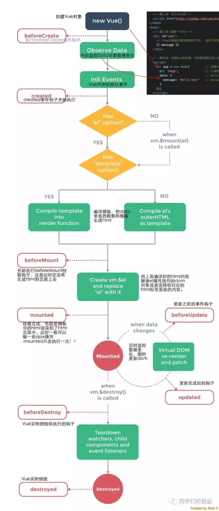
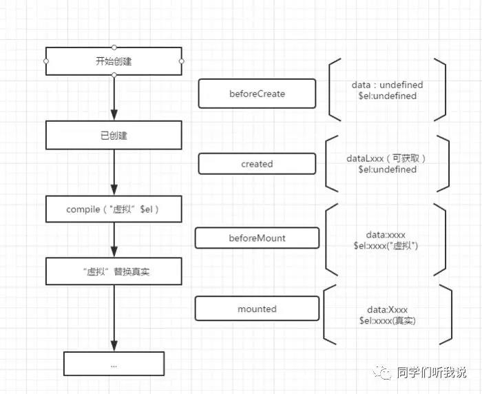

# Vue 生命周期

可以看到 vue 的生命周期分为几大阶段

* beforecreate
* created
* before Mount
* mounted
* beforeupdate
* updated
* destroyed

1. beforeCreate ---> Created: 在这个阶段，先给 新建的 vue中的 data 绑定 observer，监听数据修改，并且 初始化 vue 内部的一些事件，在这个阶段，`取不到任何 vue 实例中的 data 或者 methods，$el 也是 undefined`，都没有实例化。
2. Created ---> before Mount: 在这个阶段，vue 实例已经完成了，数据监听，属性和方法运算，watch/event 回调，因此`可以看到 data 和 method，但是$el 没有挂载，因此还是 undefined`, 这是一个最早能够拿到数据的钩子函数，一般可以在这里进行异步数据的获取和对实例数据的初始化操作
3. BeforeMount: 在挂载之前被调用，相关的 render 函数被首次调用，这时候`产生了虚拟 dom 元素，但是还不是真实 dom 元素`,因为还没有真实的挂载在 html 元素上， 要是想拿到真实 dom 元素，要在 mounted 里取。
4. Mounted: 能够拿到`真实 dom 元素`的第一个钩子函数，但是也只是能够拿到元素，不能够拿到异步渲染后的dom，例如：原始 data: {arr:[1,2,3]}如果在 created 中调用了异步的函数，会使arr 变成[1,2,3,4,5], 在 mounted 中拿到的还只是对应原来1，2，3的三个 dom，想要拿到1，2，3，4，5的 dom就要在 updated 中，同时子组件的获取也需要在 Mounted 中
5. BeforeUpdate: 数据更新后的第一个钩子函数，这个钩子函数可以拿到修改前的数据，在这个钩子函数中可以进一步修改状态，不会进一步触发附加的重渲染过程
6. Updated: 这个钩子函数调用时，组件DOM已经更新，所以可以执行依赖于DOM的操作，但是避免在这个钩子函数中修改数据，因为可能导致 updated 函数被递归触发，进入死循环。
7. BeforeDestroy: 实例销毁前调用，在这一步中，实例仍然完全可用，还可以用 this 来取到实例，一般在这一步做一些重置操作，例如取消监听器，定时器
8. Destroyed： 实例销毁后调用，调用后，所以的事件监听器会被移出，所有的子实例也会被销毁，该钩子在服务器端渲染期间不被调用

参考： [Vue-生命周期详解](https://www.jianshu.com/p/672e967e201c) [vue生命周期详解](https://zhuanlan.zhihu.com/p/53039906)