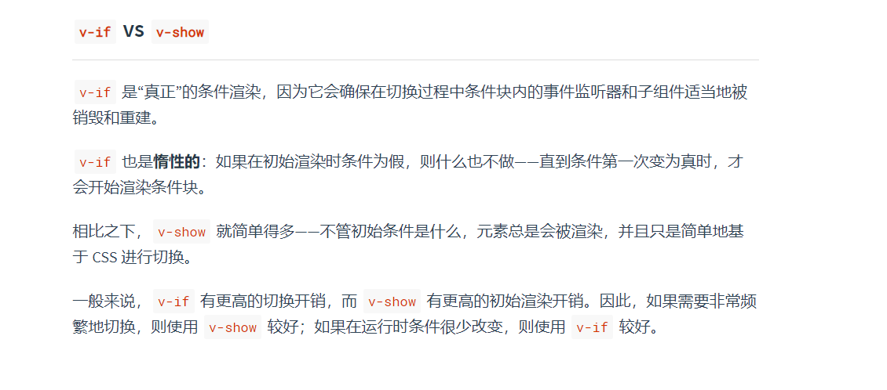

# v-if 和 v-show

v-if 是惰性的，是真正的条件渲染，只有在第一次条件为真的时候才会渲染(把元素加入 dom 树)，在为 false 的时候 dom 树中甚至没有这个元素。

v-show 是不管 true 或者 false，都会渲染这个 dom 结点，只不过控制 css 的 display: none 来控制这个结点是否显示。

可以看到，频繁切换的话还是使用 v-show 好一点，因为 v-if 的改变会频繁触发删除和增加结点，虽然 display:none 也会引起回流和重绘，但是vue 对于这部分的处理要少一些。