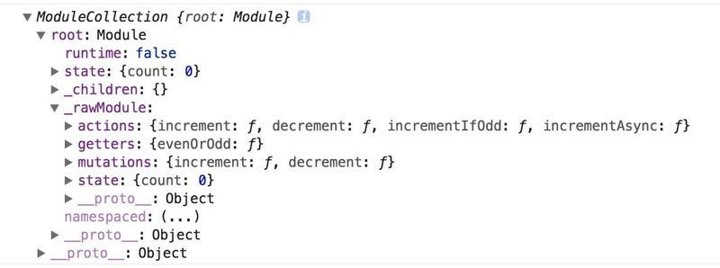
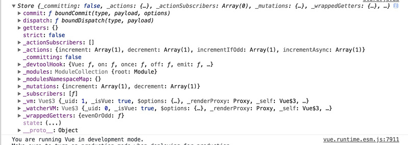

# vueX源码阅读

## vuex 的几大用法

**State**: 保存基本信息

**mutations**: 调用this.commit, 有参数 commiting控制state 只能由mutation改变而不能直接 this.$store.state.msg = ""这样改变

```javascript
const store = new Vuex.Store({
  state: {
    count: 0
  },
  mutations: {// mutation直接修改 state 中的值
    increment (state) {
      state.count++ 
    }
  },
  actions: { // action是调用 mutation
    increment (context) {
      context.commit('increment')
    }
  }
})
```


**actions**: 调用 this.dispatch, mutation 中的方法不能异步修改，而 action 中可以进行异步操作，甚至可以用 async/await 来定义，或者直接返回一个 promise。同时 action 提交的是 mutation, 页不是直接修改状态。

```javascript
// 我们在实际使用 mutation 的时候一般需要用 commit 来调用，例如
this.$store.state.commit('mutationName', value);

// 而使用 actions 的时候一般用 dispatch 来调用， 例如
this.$store.state.dispatch('actionName')
```

同时和 Mutation 不同的是，mutation 内部不能进行异步操作，例如 ajax, setTimeout 等等，但是 action 可以, 而且 组合的action中 可以返回promise，进而让其他 action 继续操作，例如

```javascript
actions: {
  async actionA ({ commit }) {
    commit('gotData', await getData())
  },
  async actionB ({ dispatch, commit }) {
    await dispatch('actionA') // 等待 actionA 完成
    commit('gotOtherData', await getOtherData())
  }
}
```

或者

```javascript
actions: {
  actionA ({ commit }) {
    return new Promise((resolve, reject) => {
      setTimeout(() => {
        commit('someMutation')
        resolve()
      }, 1000)
    })
  }
}
//调用的时候
store.dispatch('actionA').then(() => {
  // ...
})
```

**Modules**: 当 vue 项目变得复杂的时候，我们如果还是只使用一个单一的state，那么数据将会变得非常混乱，因此引入了 module 部分，允许我们将 store分成不同的 module，每个 module 都有自己的state, mutations, actions, getter 等等。

```javascript
const ModuleA = {
  	state:{},
  	mutations:{},
  	actions:{},
  	getters:{}
}
const ModuleB = {
  	state:{},
  	mutations:{},
  	actions:{},
  	getters:{}
}
const store = new Vuex.Store({
		modules:{
				a:ModuleA,
      	b:ModuleB
		}
})
//store.state.a ==== Module A的状态
// store.state.b === Module B 的状态
```

将不同的模块分开，当修改值的时候，调用不同模块的mutation， 例如

```javascript
// mutation
this.$store.commit("app/setUser", user)

// getter
this.$store.state.app.user 
```


## 源码

Vuex基本用于 vue 下，是 vue 的状态管理工具之一，是一个插件，而 vue 的官方的注册插件的方法是 vue.use()

```javascript
import Vue from 'vue'
import Vuex from 'vuex'
Vue.use(Vuex)
```

这个 vue.use 方法会调用插件的 install 方法， 这个install方法在 vuex.js 中， 整个 vuex.js 基本包含了 vuex 的所有内容，只有1000行左右，install 和 Store 的 prototype 就定义在了这个里面

```javascript
function install (_Vue) {
    if (Vue && _Vue === Vue) {
      {
        console.error(
          '[vuex] already installed. Vue.use(Vuex) should be called only once.'
        );
      }
      return
    }
    Vue = _Vue;
    applyMixin(Vue);
}
```

这里调用了 applyMixin(传入的 vue 就是实例化的 vue)

```javascript
unction applyMixin (Vue) {
    var version = Number(Vue.version.split('.')[0]);

    if (version >= 2) {
      Vue.mixin({ beforeCreate: vuexInit });
    } else {
      // override init and inject vuex init procedure
      // for 1.x backwards compatibility.
      var _init = Vue.prototype._init;
      Vue.prototype._init = function (options) {
        if ( options === void 0 ) options = {};

        options.init = options.init
          ? [vuexInit].concat(options.init)
          : vuexInit;
        _init.call(this, options);
      };
    }

    /**
     * Vuex init hook, injected into each instances init hooks list.
     */

    function vuexInit () {
      var options = this.$options;
      // 这里的 options 就是 new Vue(options)里面的这个， options 里面可能含有 store, 表示使用 vuex,所有如果有 store 的话我们需要给 vuex 进行注册。
      // store injection
      if (options.store) {
        // 如果是 root 的话则把 store 绑定到this.store
        this.$store = typeof options.store === 'function'
          ? options.store()
          : options.store;
      } else if (options.parent && options.parent.$store) {
        // 如果不是 root 的拿父级的 store，从而做到全局共用一个 store
        this.$store = options.parent.$store;
      }
    }
  }
```

applyMixin 就定义在这个文件的最开始的地方，这个**函数里面还定义了vuexInit 这个函数***,  上面判断

* 如果 vue 版本大于2，则在使用 Vue.mixin 把 vuex 的初始化函数加入 **beforeCreate** 的生命周期钩子函数中
* 如果 vue 版本小于2，则**覆盖 vue 的_init**(vuex 自己的注释里是这么写的) 函数，把 vuex 的初始化函数加入其中。

总结下这部分的话就是vue 在生命周期开始的时候，如果 vue 版本大于2，则在 beforeCreate 里面注册，如果不大于2，则覆盖 vue 的\_init 在\_init 里面注册， 并且在实例化的时候判断是否是root，如果是的话则把 \$store 绑定到 root 上，否则就取父级的\$store, 使得全局都拿到的是同一个\$store.


## Store 的构造函数

```javascript
var Store = function Store (options) {
    var this$1 = this;
    if ( options === void 0 ) options = {};

    // Auto install if it is not done yet and `window` has `Vue`.
    // To allow users to avoid auto-installation in some cases,
    // this code should be placed here. See #731
  // 先判断 vue 是否挂载在 window 上，如果是的话，说明是用 script 引入的 vue，这时候自动安装vuex
    if (!Vue && typeof window !== 'undefined' && window.Vue) {
      install(window.Vue);
    }

  	
    {
      assert(Vue, "must call Vue.use(Vuex) before creating a store instance.");
      //断言必须使用 vue.use(Vuex)
      assert(typeof Promise !== 'undefined', "vuex requires a Promise polyfill in this browser.");
      // 必须有 promise， vuex 需要 promise 的 polyfill
      assert(this instanceof Store, "store must be called with the new operator.");
      // 必须使用 new 操作符
    }
  	

    var plugins = options.plugins; if ( plugins === void 0 ) plugins = [];
    var strict = options.strict; if ( strict === void 0 ) strict = false;

    // store internal state
  	// 这个是提交状态的变量
    this._committing = false;
  
  
  	// 下面这两个用于保存和监听所有 actions
    this._actions = Object.create(null);
    this._actionSubscribers = [];
  
  	// 下面这个用于保存 mutations
    this._mutations = Object.create(null);
    this._wrappedGetters = Object.create(null);
    this._modules = new ModuleCollection(options);
  	// 这一步进行module 收集
    this._modulesNamespaceMap = Object.create(null);
  	
  	// 这一步是用于监听 mutations
    this._subscribers = [];
    this._watcherVM = new Vue();
    this._makeLocalGettersCache = Object.create(null);

    // bind commit and dispatch to self
    var store = this;
    var ref = this;
    var dispatch = ref.dispatch;
    var commit = ref.commit;
  
  	// dispatch 是用来触发 action 的函数，即 action 是 dispatch 触发, 但是内部其实调用的还是 mutation 中的方法修改数据，并不直接修改。
    this.dispatch = function boundDispatch (type, payload) {
      return dispatch.call(store, type, payload)
    };
  	
  	// commit 是用来触发 mutation 的函数，即使用 mutation 中的函数实际上是 commit 触发的
    this.commit = function boundCommit (type, payload, options) {
      return commit.call(store, type, payload, options)
    };

    // strict mode
    this.strict = strict;

    var state = this._modules.root.state;

    // init root module.
    // this also recursively registers all sub-modules
    // and collects all module getters inside this._wrappedGetters
    installModule(this, state, [], this._modules.root);

    // initialize the store vm, which is responsible for the reactivity
    // (also registers _wrappedGetters as computed properties)
    resetStoreVM(this, state);

    // apply plugins
    plugins.forEach(function (plugin) { return plugin(this$1); });

    var useDevtools = options.devtools !== undefined ? options.devtools : Vue.config.devtools;
    if (useDevtools) {
      devtoolPlugin(this);
    }
  };
```

1. 这部分先判断 vue 是否挂载在 window 上，如果是的话说明是用 script 标签引入的 vue，这种情况下自动安装。
2. 然后实例化了一些 Store 上的属性，例如_actions, _mutations 来保存 Vue 上面的 actions 和 mutations
3. 实例化了_committing，当使用 mutation的时候，在 mutation 内部会先把其置为 true，然后修改 state 之后再赋值为 false，防止直接修改 state（**也就是这个属性控制只有 mutation 可以修改 state**）

可以看到在 store 构造函数的后半部分，调用了

```javascript
var state = this._modules.root.state;

this._modules = new ModuleCollection(options);

installModule(this, state, [], this._modules.root);

// this._modules.root.state是一个实例化的 moduleCollections
```

也就是对于 options 中传入的 Module 去进行注册，下面看看installModule 做了什么


## ModuleCollection和installModule

### Module Collection

```javascript
var ModuleCollection = function ModuleCollection (rawRootModule) {
    // register root module (Vuex.Store options)
    this.register([], rawRootModule, false);
  };

	// 根据 path 获得 module, 因为在 Modules 下会有对应的 module，有的时候是这种形式的
	// import a from './a.js'
	// import b from './b.js'
	// 然后再下面的 store 是
	// const store = new Vuex.Store({
	//			Modules:{
	//					moduleA: a
  //          moduleB: b
  //      }
	//})
	//	 这里的 a，b 都需要对应 path 来寻找
  ModuleCollection.prototype.get = function get (path) {
    return path.reduce(function (module, key) {
      return module.getChild(key)
    }, this.root)
  };

  ModuleCollection.prototype.getNamespace = function getNamespace (path) {
    var module = this.root;
    return path.reduce(function (namespace, key) {
      module = module.getChild(key);
      return namespace + (module.namespaced ? key + '/' : '')
    }, '')
  };

  ModuleCollection.prototype.update = function update$1 (rawRootModule) {
    update([], this.root, rawRootModule);
  };

  ModuleCollection.prototype.register = function register (path, rawModule, runtime) {
      var this$1 = this;
      if ( runtime === void 0 ) runtime = true;

    {
      assertRawModule(path, rawModule);
    }
		
    // 一个 Module 的构造函数
    var newModule = new Module(rawModule, runtime);
    if (path.length === 0) {
      this.root = newModule;
    } else {
      var parent = this.get(path.slice(0, -1));
      parent.addChild(path[path.length - 1], newModule);
    }

    // register nested modules
    // 如果当前 module 存在子 module 则递归注册子 module
    if (rawModule.modules) {
      forEachValue(rawModule.modules, function (rawChildModule, key) {
        this$1.register(path.concat(key), rawChildModule, runtime);
      });
    }
  };
	
  ModuleCollection.prototype.unregister = function unregister (path) {
    var parent = this.get(path.slice(0, -1));
    var key = path[path.length - 1];
    if (!parent.getChild(key).runtime) { return }

    parent.removeChild(key);
  };

  ModuleCollection.prototype.isRegistered = function isRegistered (path) {
    var parent = this.get(path.slice(0, -1));
    var key = path[path.length - 1];

    return parent.hasChild(key)
  };
```

* 这个在 store 的构造函数中调用`this._modules = new ModuleCollection(options);​`表示Modules 也是挂载在 store上
* 先根据 Path 注册根module，然后遍历所有 module 递归注册，子 module 挂载在父module 上，最终形成一棵树



* 总结来说 ModuleCollection 就是对于所有 Module 的一个收集

### installModule

在上面通过 ModuleCollection 之后，我们要进行 对每个module 的实例化

```javascript
installModule(this, state, [], this._modules.root);
// 可以看到这里传入的是 state， 正在创建的 Store实例(this) ,还有上面的 ModuleCollection实例(根 module)

// 然后根据传入的根 module，遍历其子 module，然后对其逐一完成注册
```

函数实现如下：

```javascript
function installModule (store, rootState, path, module, hot) {
    var isRoot = !path.length;
    var namespace = store._modules.getNamespace(path);

    // register in namespace map
  	// 判断是否指定了 namespaced 属性
    if (module.namespaced) {
      if (store._modulesNamespaceMap[namespace] && true) {
        console.error(("[vuex] duplicate namespace " + namespace + " for the namespaced module " + (path.join('/'))));
      }
      store._modulesNamespaceMap[namespace] = module;
    }

    // set state
    if (!isRoot && !hot) {
      var parentState = getNestedState(rootState, path.slice(0, -1));
      var moduleName = path[path.length - 1];
      store._withCommit(function () {
        {
          if (moduleName in parentState) {
            console.warn(
              ("[vuex] state field \"" + moduleName + "\" was overridden by a module with the same name at \"" + (path.join('.')) + "\"")
            );
          }
        }
        // 将当前的 state 挂载 parent 的 state 下面
        Vue.set(parentState, moduleName, module.state);
      });
    }
		
  	// 这一步是设置此 module 的上下文，存放在 module.context 中
    var local = module.context = makeLocalContext(store, namespace, path);

  	// 注册 mutation
    module.forEachMutation(function (mutation, key) {
      var namespacedType = namespace + key;
      registerMutation(store, namespacedType, mutation, local);
    });
		// 注册 action
    module.forEachAction(function (action, key) {
      var type = action.root ? key : namespace + key;
      var handler = action.handler || action;
      registerAction(store, type, handler, local);
    });
		
  	// 注册 getter
    module.forEachGetter(function (getter, key) {
      var namespacedType = namespace + key;
      registerGetter(store, namespacedType, getter, local);
    });

  	// 递归注册子 module，因为子 module 还可能会有自己的 module
    module.forEachChild(function (child, key) {
      installModule(store, rootState, path.concat(key), child, hot);
    });
  }
```

makeLocalContext部分源码, 这里不多说了:

```javascript
function makeLocalContext (store, namespace, path) {
    var noNamespace = namespace === '';

    var local = {
      dispatch: noNamespace ? store.dispatch : function (_type, _payload, _options) {
        var args = unifyObjectStyle(_type, _payload, _options);
        var payload = args.payload;
        var options = args.options;
        var type = args.type;

        if (!options || !options.root) {
          type = namespace + type;
          if ( !store._actions[type]) {
            console.error(("[vuex] unknown local action type: " + (args.type) + ", global type: " + type));
            return
          }
        }

        return store.dispatch(type, payload)
      },

      commit: noNamespace ? store.commit : function (_type, _payload, _options) {
        var args = unifyObjectStyle(_type, _payload, _options);
        var payload = args.payload;
        var options = args.options;
        var type = args.type;

        if (!options || !options.root) {
          type = namespace + type;
          if ( !store._mutations[type]) {
            console.error(("[vuex] unknown local mutation type: " + (args.type) + ", global type: " + type));
            return
          }
        }

        store.commit(type, payload, options);
      }
    };

    // getters and state object must be gotten lazily
    // because they will be changed by vm update
    Object.defineProperties(local, {
      getters: {
        get: noNamespace
          ? function () { return store.getters; }
          : function () { return makeLocalGetters(store, namespace); }
      },
      state: {
        get: function () { return getNestedState(store.state, path); }
      }
    });

    return local
  }
```

## resetStoreVM

```javascript
//store 的构造函数中的resetStoreVM(this, state)

function resetStoreVM (store, state, hot) {
    var oldVm = store._vm;

    // bind store public getters
    store.getters = {};
    // reset local getters cache
    store._makeLocalGettersCache = Object.create(null);
    var wrappedGetters = store._wrappedGetters;
    var computed = {};
    forEachValue(wrappedGetters, function (fn, key) {
      // use computed to leverage its lazy-caching mechanism
      // direct inline function use will lead to closure preserving oldVm.
      // using partial to return function with only arguments preserved in closure environment.
      computed[key] = partial(fn, store);
      Object.defineProperty(store.getters, key, {
        get: function () { return store._vm[key]; },
        enumerable: true // for local getters
      });
    });

    // use a Vue instance to store the state tree
    // suppress warnings just in case the user has added
    // some funky global mixins
    var silent = Vue.config.silent;
    Vue.config.silent = true;
    store._vm = new Vue({
      data: {
        $$state: state
      },
      computed: computed
    });
    Vue.config.silent = silent;

    // enable strict mode for new vm
    if (store.strict) {
      enableStrictMode(store);
    }

    if (oldVm) {
      if (hot) {
        // dispatch changes in all subscribed watchers
        // to force getter re-evaluation for hot reloading.
        store._withCommit(function () {
          oldVm._data.$$state = null;
        });
      }
      Vue.nextTick(function () { return oldVm.$destroy(); });
    }
  }
```





Vuex 还有一些插件注册等方法和属性， 这里不多说了，详细的部分参考的最后一个中有。

参考：

1. [Vuex白话教程第四讲：Vuex旗下的Action](https://www.jianshu.com/p/7238d4d42725)
2. [vuex中modules的基本用法](https://blog.csdn.net/weixin_44539392/article/details/107736414)
3. [Vuex源码阅读分析](https://segmentfault.com/a/1190000014363436)

