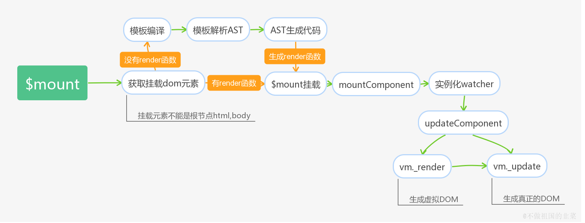

# Vue 源码阅读2

这部分讲解实例挂载和模板编译

Vue 基于源码可能会构建出两种版本，一种是runtime only的版本，一种是 runtime + compiler(一个同时包含编译器和运行时的版本)

1. 一个完整的 vue 版本是**包含编译器**的，我们可以按照

```javascript
// 需要编译器的版本
new Vue({
  template: '<div>{{ hi }}</div>'
})
```

来进行模板编写，编译器会自动将其转化为渲染函数的代码

2. 只包含运行时的代码拥有创建`Vue`实例、渲染并处理`Virtual DOM`等功能，基本上就是除去编译器外的完整代码。因此我们需要手写 render 函数

```javascript
// 不需要编译器
new Vue({
  render (h) {
    return h('div', this.hi)
  }
})
```

## 模板编译和挂载



**编译部分**：

可以看到上面有两种分支：

* 当写法是使用 render 函数的写法时，则可以直接获取 dom 元素，直接调用 vue 原型链上定义的$mount 函数进行挂载。
* 当写法是 template 字符串时候需要进行模板编译，先解析出 AST(Abstract syntax tree 抽象语法树) 树，再对应生成 render 函数，然后再使用$mount 函数挂载


**挂载部分**

无论是 render 函数写法还是 template 写法，都会进入 mountComponent 过程，这个阶段会实例化一个渲染的 watcher，watcher 的执行时机有两种，一个是在初始化的时候，另一个就是检测到数据发生改变的时候。


回调函数是执行 updateComponent 的过程，这个过程分为两个部分:

1. Vm.\_render: vm.\_render 会执行前面的渲染函数，生成一个 vitrual dom tree
2. vm.\_update: vm.\_update 会根据这个 vitrual dom tree 生成真实 dom 结点


### 模板编译部分

template 共有3种写法：

* 字符串模板 

```javascript
var vm = new Vue({
  el: '#app',
  template: '<div>模板字符串</div>'
})
```

* 选择符匹配元素的 `innerHTML`模板

```javascript
<div id="app">
  <div>test1</div>
  <script type="x-template" id="test">
    <p>test</p>
  </script>
</div>
var vm = new Vue({
  el: '#app',
  template: '#test'
})
```

* `dom`元素匹配元素的`innerHTML`模板

```javascript
<div id="app">
  <div>test1</div>
  <span id="test"><div class="test2">test2</div></span>
</div>
var vm = new Vue({
  el: '#app',
  template: document.querySelector('#test')
})
```

在模板编译之前会对这个 template 模板的合法性进行分析，在Vue.prototype.$mout 中，上面三个对应三种情况是分开对待的。

**编译部分图解**：


可以看到上面涉及多个函数

* CompileToFunctions: 三个参数，第一个是 template, 第二个是配置信息，用户可以自己设置，第三个是 vue 实例，这个方法是暴露给用户的编译方法, 不过这个是

```javascript
Vue.compile = compileToFunctions;
// 将compileToFunction方法暴露给Vue作为静态方法存在
```

那么看看这个 function 是从哪里来的，有一个 function 为createCompilerCreator，其第一个参数是另一个函数baseCompile，这个函数返回三个值 ast, 

```javascript
var createCompiler = createCompilerCreator(function baseCompile (template,options) {
  //把模板解析成抽象的语法树
  var ast = parse(template.trim(), options);
  // 配置中有代码优化选项则会对Ast语法树进行优化
  if (options.optimize !== false) {
    optimize(ast, options);
  }
  var code = generate(ast, options);
  return {
    ast: ast,
    render: code.render,
    staticRenderFns: code.staticRenderFns
  }
})// 这里是参数的结束，上面所有的是第一个参数，为一个函数， 下面才是这个 function 的定义阶段。
{
  return function createCompiler (baseOptions) {
      // 内部定义compile方法
      function compile (template, options) {
        ···
      }
      return {
        compile: compile,
        compileToFunctions: createCompileToFunctionFn(compile)
      }
    }
  
}
                                          
                                          
                                          
                                          


var ref$1 = createCompiler(baseOptions);
var compile = ref$1.compile;
var compileToFunctions = ref$1.compileToFunctions;
```

而 compile 函数为

```javascript
function createCompiler (baseOptions) {
  function compile (template, options) {
        var finalOptions = Object.create(baseOptions);
        var errors = [];
        var tips = [];
        var warn = function (msg, range, tip) {
          (tip ? tips : errors).push(msg);
        };
        // 选项合并
        if (options) {
          ···
          // 这里会将用户传递的配置和系统自带编译配置进行合并
        }

        finalOptions.warn = warn;
        // 将剔除空格后的模板以及合并选项后的配置作为参数传递给baseCompile方法
        var compiled = baseCompile(template.trim(), finalOptions);
        {
          detectErrors(compiled.ast, warn);
        }
        compiled.errors = errors;
        compiled.tips = tips;
        return compiled
      }
      return {
        compile: compile,
        compileToFunctions: createCompileToFunctionFn(compile)
      }
}
```

