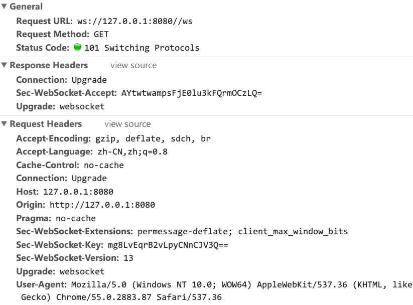

# Websocket协议原理

在开发过程中，经常会碰到一种问题，实时问题，例如基于 web 的聊天功能，多玩家游戏功能，这种情况下需要实时的更新数据，但是会有一些问题：

## 难题

HTTP 协议本身是一个单向无状态的协议，也就是说只有用户发起 request，服务器才会回复 response，并且在连接断开之后，服务器不保持用户状态，虽然在 http1.1 之后使用长连接，在一次 request 之后不会断开连接。

而HTTP的 request - response 模式，纯粹是人为规定的，并不存在技术上的问题。即服务器只能回应用户要求而不能主动发送数据(HTTP2.0之后支持了)。

因此 http 协议是本身不具备持久通信能力的，但是我们在实际的应用中，是很需要这种能力的，因此诞生了 websocket 协议，来解决这个问题。

## 如果不使用 websocket

如果不使用 websocket 协议，那么基于 HTTP 可能的解决方法有：

* AJax 轮询: 即每隔一段时间发送一次请求，查看是否有新信息，这种方法效率很低，并且服务器负担会很大
* Long poll: 这种方法是阻塞式的，每次客户端发起一个连接，查看是否有新消息，服务器挂起这次请求，直到有更新才返回，然后断开连接。之后再由客户端重新发起请求

这两种方法都有弊端，即服务器资源浪费。服务器需要花费资源来维持连接，并且即使是 long poll 服务器也要查询状态变化。很可能会导致服务器崩溃

## Websocket 协议

Websocket 协议是基于 TCP 的，是全双工的持久的连接。

**WebSocket是HTML5出的东西（协议）**，也就是HTML协议没变化。

Websocket 也需要通过已经建立的 TCP 连接来进行通信，但是为了兼容性需要使用 HTTP 来建立通道，之后就和 HTTP 没有任何关系了。

WebSocket 本质上跟 HTTP 完全不一样，只不过**为了兼容性**，WebSocket 的握手是以 HTTP 的形式发起的。

下图是一个 Websocket协议请求头:

### Request header

可以看到 request 中多了几个字段：

* Sec-WebSocker-key: 是浏览器随机生成的 base64 encode 的一个字符串，用于验证服务器是否支持 websocket
* Sec-WebSocket-version: 表示需要使用的 websocket 协议班本
* upgrade: websocket 表示要从 http 转协议到 websocket

### Response header

* Connection:upgrade 表示成功建立 websocket 连接
* upgrade: websocket 表示是 websocket 连接
* Sec-WebSocker-accepted: 和上面的 key 类似，表示接受 websocket

可以看到 http 的状态码为101，表示协议转换。至此 HTTP 结束工作，剩下的就交给 websocket 来做了。

## Websocket 的好处

Websocket 的好处就是可以主动向客户端推送信息了，并且它是一个依赖 tcp 进行沟通的协议。建立 websocket 连接之后，互相沟通所消耗的请求头是很小的

缺点：

* 少部分浏览器不支持，浏览器支持的程度与方式有区别

这种协议在服务端会保持客户端的状态，并且收到更新的时候可以主动推送信息给客户端，

参考:[WebSocket 是什么原理？为什么可以实现持久连接？](https://www.zhihu.com/question/20215561)

