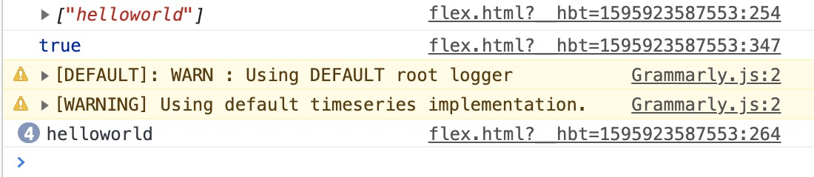

# 函数节流和防抖

有的时候，前端需要监控用户滚动，来触发一些事件，可能是判断，可能是执行一些语句，即

```javascript
window.addEventListener('scroll', doSomething());
```

那么用户每次滚动，scroll 都会触发很多次，这会给浏览器带来很大的负担，而且并不必要，这样一来就有了两种解决方式，**防抖(debounce)和节流(throttle)**


## 防抖(debounce)

所谓防抖就是让事件触发的时候不立即执行，而是设置一个定时器，如果在定时器时间内没有再次出发定时器，则执行处理函数，否则刷新定时器事件，例如事件 计时器为500ms 时候

* 500ms之内，如果再次触发，则刷新定时器，仍然等于500ms
* 500ms 结束，执行函数

为了保证全局变量不污染，于是考虑使用一个闭包来实现，由于是闭包实现，于是相当于有一个全局变量 timeout，任意的处理 function 都可以访问到，于是上一个函数完成之前访问这个 timer 都是不为空的，clearTimeout 就会清空这个值。

```javascript
function debounce(fn) {
    let timeout = null; // 创建一个标记用来存放定时器的返回值
    return function () {
        // 每当用户输入的时候把前一个 setTimeout clear 掉
        console.log(`Clear Timeout ${timeout}??`)
        clearTimeout(timeout); 
        // 然后又创建一个新的 setTimeout, 这样就能保证interval 间隔内如果时间持续触发，就不会执行 fn 函数
        timeout = setTimeout(() => {
            fn.apply(this, arguments);
        }, 500);
      	console.log(`setTimeout ${timeout}!!`)
    };
}
// 处理函数
function handle() {
    console.log(Math.random());
}
// 滚动事件
window.addEventListener('scroll', debounce(handle));
```

下图为上图的输出图片，在页面中不停滚动，可以看到 timeout 被不停的重置，设置，重置设置


## 节流

可以看到，上面的情况，如果用户不断触发 scroll 事件，那么执行函数就永远不会执行。应该有一种方式，使得在一定间隔之内，函数都要执行一次(如果用户一直触发或者触发过一次)。

```javascript
function throttle(fn, content){
		   let timeout = null;
		   return function(){
		     		let this_ = this;
		     		if (timeout) return;
		     		timeout = setTimeout(()=>{
		          				fn.call(this_,content);
		        					timeout = null;}, 1000)
		   }
		}
		function handler(content){
		   console.log(content);
		}
		window.addEventListener('scroll', throttle(handler, 'helloworld'));


//或者
function throttle(fn, content){
		   let timeout = null;
  		 let c = Array.from(arguments).splice(1); 
		   return function(){
		     		let this_ = this;
		     		if (timeout) return;
		     		timeout = setTimeout(()=>{
		          				fn.apply(this_,c);
		        					timeout = null;}, 1000)
		   }
}

```

上图中判断timeout 是否为 null, 如果为 null 的话可以再次触发事件，否则的话说明上次触发的事件还没有完成，则退出。

上面保存了 this 为 return 的 functiond的 this，使得 fn 能够访问到 content 变量，在执行完成后让 timeout=null，这样再次触发事件可以再次执行这个函数。


**无论下面的 scroll 触发多少次，闭包始终只会执行一次，即在绑定事件的时候执行一次，之后闭包中的变量相当于返回函数的父级作用域的变量，可以继续使用。**

下面图片为上面第二部分的执行结果，可以看到不管触发多少次 scroll, 闭包只执行了一次。




参考: [函数防抖和节流](https://www.jianshu.com/p/c8b86b09daf0)