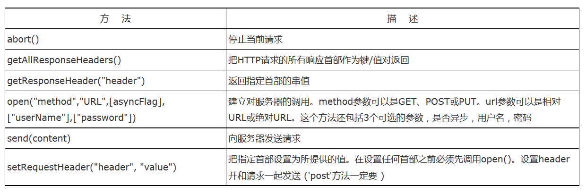
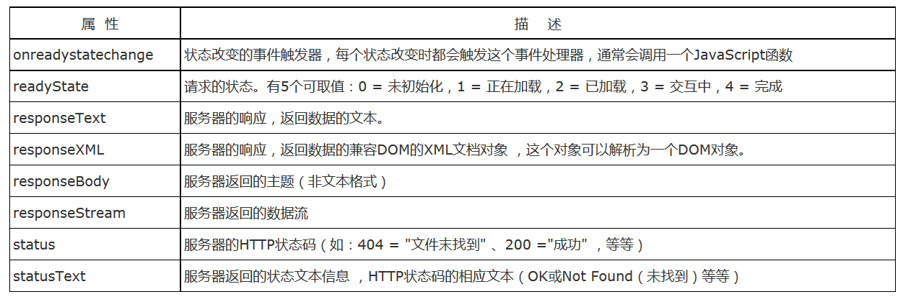
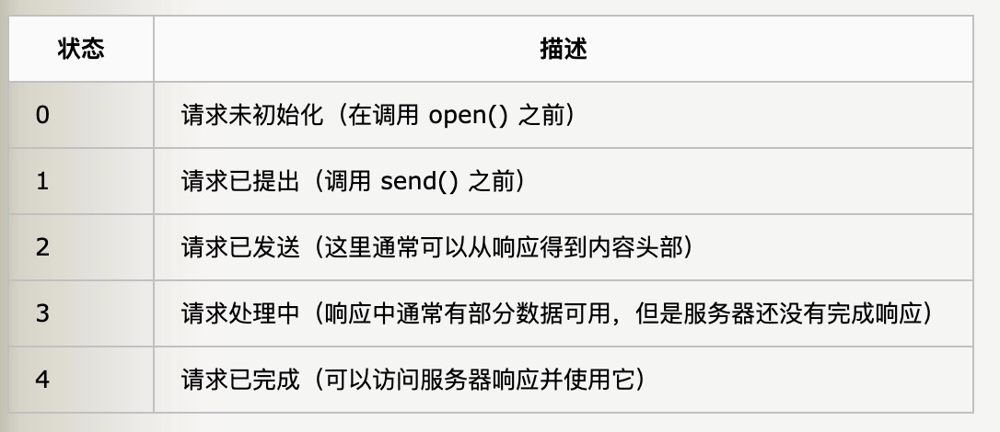
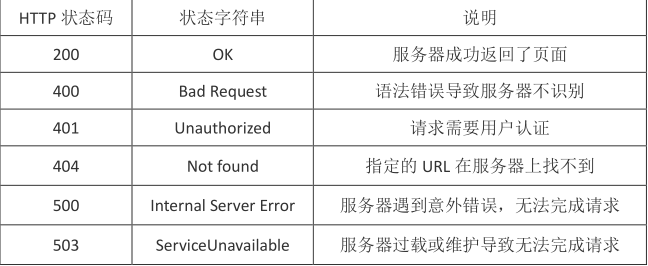

# 原生实现 Ajax

Ajax 技术核心是 XMLHttpRequest 对象(简称 XHR)，XHR 的出现，提供了向服务器发送请求和解析服务器响应提供了流畅的接口。能够以**异步方式从服务器获取更多的信息，这就意味着，用户只要触发某一事件，在不刷新网页的情况下，更新服务器最新的数据**。

```javascript
var xhr = XMLHttpRequest()
```



一个 XMLHttpRequest 有以下几个方法：

1. open(): 接受三个参数(注意open 函数只是准备工作，并没有真正发送 request):
   * 请求的方法，例如 GET 或者 POST
   * 请求的 url
   * 是否采用异步方式

2. send(): 接受一个参数，为请求内容，如果没有必须为 null

XMLHttpRequest 有以下几种属性：



对于上面的 **readyState** 的可能值：




## 同步调用方法

```javascript
let xhr = XMLHttpRequest()
xhr.open('GET','http:xxx.com/api', false) //这里 false 表示同步请求。
xhr.send(null)
if (xhr.status == 200){
  let text=xhr.responseText;
  console.log(text)
}
```

虽然同步的效果也不错，但是异步请求才是真正常用的。


## 异步调用方法

1. Get 方法

```javascript
let xhr = XMLHttpRequest()
xhr.open('GET', 'http:xxx.com/api?id=1&name=3', true) // 这里 true 代表异步请求 ,?后面跟着 get 请求的参数
xhr.send(null) //因为是 GET 所以请求的 content 为空
xhr.onreadystatechange = function(){
  	if (xhr.readyState == 4){
      	if (xhr.status == 200){
           let text = xhr.responseText;
           console.log(text);
        }
    }
}
```

2. Post方法

```javascript
let xhr = XMLHttpRequest()
xhr.open('POST', 'http:xxx.com/apipost',true)
xhr.setRequestHeader("Content-Type", "application/x-www-form-urlencoded;charset=UTF-8");
xhr.send(data)
xhr.onreadystatechange = function(){
  	if (xhr.readyState == 4){
      	if (xhr.status == 200){
            //do something
        }
      	else if (xhr.status == 400){
          	//do something
        }
      	else if (xhr.status == 404){
          	//do something
        }
    }
}
```


```javascript
function ajax(url, method, async, param){
		return new Promise((resolve, reject)=>{
				let xhr = new XMLHttpRequest();
        xhr.open(method, url);
      	xhr.send(param);
      	xhr.onreadystatechange = ()=>{
          	if (xhr.readyState == 4){
								if (xhr.status == 200){
										resolve(xhr.responseText)
								}
						}
          	else{
								reject(xhr.statusText)
            }
        }
		})
}
```

如果不用 onreadystatechange 可以使用 xhr.onload = function 这样就不需要再判断 readyState == 4了

## XMLHttpRequest  status状态码



参考: [ajax 的底层实现](https://www.cnblogs.com/liu1459310172/p/9590053.html)

