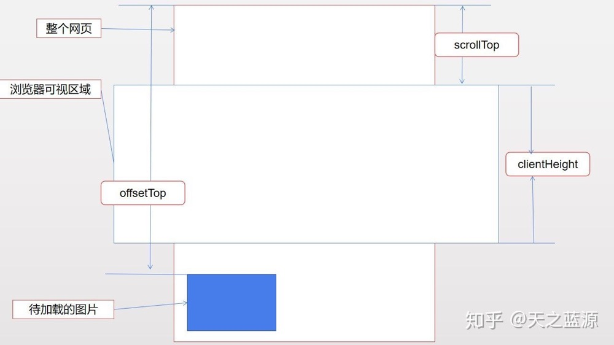

# 图片懒加载

懒加载突出一个“懒”字，懒就是拖延迟的意思，所以“懒加载”说白了就是延迟加载，比如我们加载一个页面，这个页面很长很长，长到我们的浏览器可视区域装不下，那么懒加载就是**优先加载可视区域的内容，其他部分等进入了可视区域在加载**。

## 实现原理

一张图片就是一个标签，而图片的来源主要是src属性。浏览器是否发起亲求就是根据是否有src属性决定的。这样一来，我们可以对没有进入可视区域的图片不进行 src 配置，当图片进入可视区域之后，再配置其 src 属性，这样再未进入该区域之前，图片就不会被加载。

## 可视区域的判断



上图中的可视区域即是我们需要判断的区域，为了判断这个区域，需要使用3个数据：

* 可视区域大小clientHeight(**document.documentElement.clientHeight()**或者**window.innerHeight()**)
* 图片距离顶部的距离offsetTop(**el.getBoundingClientRect()**其中 el 代表 img 这个元素)
* 滚动轴距离顶部的距离`scrollTop`(**document.documentElement.scrollTop()**)

 从上面可以看出，如果 `offsetTop - scrollTop <= clientHeight`则图片进入了可视区域，需要被加载

```javascript
var imgs = document.querySelectorAll('img'); //这里返回一个 NodeList 对象，
var imgs = document.getElementsByTagName('img'); // 这里返回一个 HTML collection 对象

        //用来判断bound.top<=clientHeight的函数，返回一个bool值
        function isIn(el) {
            var bound = el.getBoundingClientRect(); // 获取元素 rect 位置，top 属性为距离 dom 顶部的距离
            var clientHeight = window.innerHeight; //
            return bound.top <= clientHeight;
        } 
        //检查图片是否在可视区内，如果在，则加载
        function check() {
            Array.from(imgs).forEach(function(el){ //这里通过 from 将 NodeList 对象转化为数组
                if(isIn(el)){
                    loadImg(el);
                }
            })
        }
        function loadImg(el) {
            if(!el.src){
                var source = el.dataset.src;
                el.src = source;
            }
        }
				// 在进入页面的时候也需要判断是否加载
        window.onload = window.onscroll = function () { //onscroll()在滚动条滚动的时候触发
            check();
        }
```

参考: [原生js实现图片懒加载（lazyLoad)](https://zhuanlan.zhihu.com/p/55311726?utm_source=wechat_session&utm_medium=social&utm_oi=984754533125271552&utm_content=first)