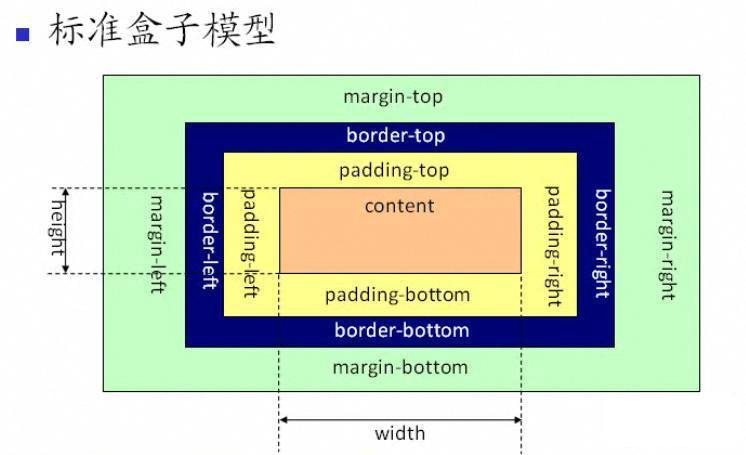
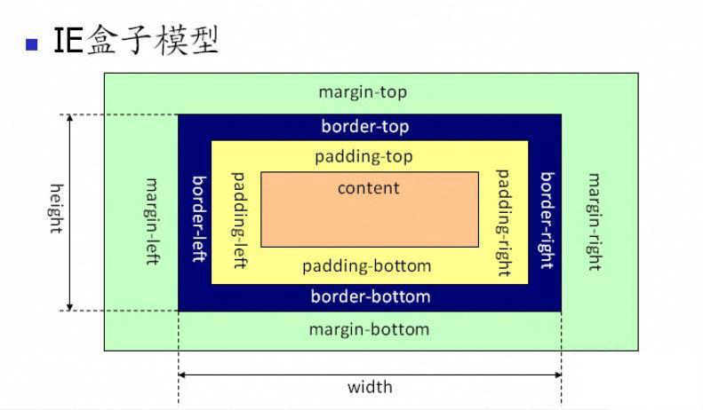

# 标准盒模型和怪异盒模型

## 标准盒模型

标注盒模型下，width 和 height 表示 content 的 width 和 height

一个块的宽度 = width + margin(左右) + padding(左右) + border(左右)

## 怪异盒模型(IE 盒模型)

在怪异盒模型下，width 和 height 表示 content + padding + border

一个块的总宽度 = width + margin(左右)， 即 width 已经包含了 content, padding 和 border

## Box-sizing:

可取值:

content-box || border-box || inherit || initial

* 默认为 content-box, 表示 width和 height 只表示 content
* Border-box: 表示使用怪异盒模型，widht 和 height 表示 content + padding + border

一般的使用场景为：当不希望 padding 撑开内容的时候，就使用 border-box，则容器设定的 width 包含 content + padding + border