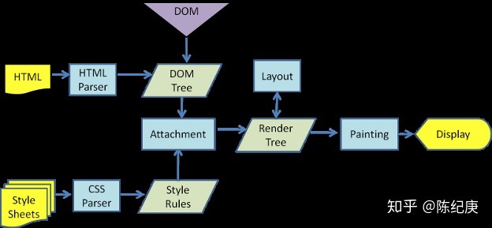

# 回流和重绘

## 浏览器的渲染过程




1. 解析 HTML，生成 DOM 树
2. 解析 CSS，生成 CSS 树
3. 将 DOM 树和 CSS 树结合，形成渲染树(Render Tree)
4. 根据渲染树，进行**回流**, 得到结点的几何信息(位置，大小)。
5. 根据回流得到的几何信息，得到一个节点的绝对像素(就是某个像素是什么色的)
6. 将像素信息发给 GPU，展示在页面上。


## 渲染树的生成

从 Dom 树根节点开始遍历结点，对于每个**`可见`**的节点, 在 CSS 树中找到对应规则并且应用它，根据每个结点和其对应的规则，组合生成渲染树。

> 不可见结点：
>
> * 不会渲染输出的节点，例如<script> <meta> <link>
> * dsplay:none 的节点，注意：用 visibility:hidden 和 opacity 隐藏的节点是会出现在渲染树上的。

**渲染树只包含可见结点。**


## 回流

前面已经通过渲染树，将 dom 和其样式结合了起来，但是我们还是需要计算在设备可视区域的确切位置和大小(例如渲染树内某个结点大大小是百分之80的，那么还需要计算在固定窗口下，百分之80是多少像素，还有有了具体像素之后，各个元素具体在什么位置。）


总结一下回流是计算元素的大小和位置信息，在特定设备的可是窗口下，到底占多少像素，位置在哪里。


## 重绘

在上一步回流中，得到了某些元素的大小和位置，同时还有渲染树中的其他信息，那么重绘就是要把对应某元素的像素点上色的过程，例如一个红色宽高为300px，在页面左上角的 div，就需要在指定位置300* 300，全部绘制为红色像素。这一步绘制只是在计算效果，将结果交给 GPU 之后结果就展现在设备上。


### 注意回流一定会引发重绘，而重绘不一定会导致回流。

个人对于这句话的理解为，对于几何信息的变化，例如大小变化，肯定会导致对于视图的重新计算，因为这些大小信息可能还会影响其他的元素，而有些改变，例如颜色变化，不会导致大小的变化，因此不会触发回流，只触发重绘，而对于回流，由于大小信息变化，导致原来位置的像素都可能发生变化，因此回流一定会导致重绘。


## 如何触发回流和重绘

前面知道了，回流主要是计算几何信息，例如位置和大小，那么当页面布局和集合信息发生变化的时候，就需要回流。例如：

* 添加或者删除dom 元素
* 元素位置发生变化
* 元素尺寸发生变化(内外边距，border，高度宽度)
* 内容变化，例如文本被图片替代
* 页面刚开始渲染的时候[这部分避免不了]
* 浏览器窗口尺寸变化[开发者模式下自己调整，或者用户缩放？]


## 浏览器的优化机制

现代浏览器一般不会短时间多次重排，而是将修改放入队列中，当超过一定时间或者操作达到了一个阈值，才清空队列。但是**当获取布局信息的时候，就会强制队列刷新**。例如：

* offsetTop、offsetLeft、offsetWidth、offsetHeight
* scrollTop、scrollLeft、scrollWidth、scrollHeight
* clientTop、clientLeft、clientWidth、clientHeight
* getComputedStyle()
* getBoundingClientRect

因此如果需要使用上面的属性的时候，尽量先缓存起来，而不是多次获取，因为会导致多次回流。


## 人为优化减少重排和重绘


### 批量修改 css 或者 class 赋值

```javascript
const el = document.getElementById('test');
el.style.padding = '5px';
el.style.borderLeft = '1px';
el.style.borderRight = '2px';
```

上面修改了3个属性，每一个都会影响元素的几何结构，虽然由于浏览器优化，只会触发一次回流。但是如果使用了布局信息，就会导致3次重排。

可以改为：

```javascript
const el = document.getElementById('test'); 
el.style.cssText += 'border-left: 1px; border-right: 2px; padding: 5px;'; 
```

或者

```javascript
const el = document.getElementById('test'); 
el.className += ' active'; 
```


### 批量修改 dom 时，可以先脱离文档流，再修改

有三种方式可以脱离文档流：

* 先修改元素 display 为 none，修改元素样式，再将 display 改回去
* 将原始信息拷贝到一个新创建的节点中，修改完成后替换
* 用文档片段 document fragment在dom 外构建一个子树，再将其拷贝回 dom

```javascript
function appendDataToElement(appendToElement, data) {
    let li;
    for (let i = 0; i < data.length; i++) {
    	li = document.createElement('li');
        li.textContent = 'text';
        appendToElement.appendChild(li);
    }
}

const ul = document.getElementById('list');
appendDataToElement(ul, data);
```

例如上面的每次循环都会导致布局信息改变，从而导致回流，就需要优化。

```javascript
function appendDataToElement(appendToElement, data) {
    let li;
    for (let i = 0; i < data.length; i++) {
    	li = document.createElement('li');
        li.textContent = 'text';
        appendToElement.appendChild(li);
    }
}
const ul = document.getElementById('list');
ul.style.display = 'none';
appendDataToElement(ul, data);
ul.style.display = 'block';
// 这种方法会在隐藏和展现的时候产生两次重绘制
```

```javascript
const ul = document.getElementById('list');
const clone = ul.cloneNode(true);
appendDataToElement(clone, data);
ul.parentNode.replaceChild(clone, ul);
// 先脱离文档结点再替换回去
```

## 避免触发同步布局事件

下面的代码

```javascript
function initP() {
    for (let i = 0; i < paragraphs.length; i++) {
        paragraphs[i].style.width = box.offsetWidth + 'px';
    }
}
```

我们想将 p 标签宽度改为某个元素的宽度的时候，就可能写出这样的代码。但是其实每次循环开始的时候，都需要将上次的改变应用(flush 掉回流队列)，然后再做这次改变。即会导致多次回流重绘。

解决方法是缓存下来这个属性

```javascript
const width = box.offsetWidth;
function initP() {
    for (let i = 0; i < paragraphs.length; i++) {
        paragraphs[i].style.width = width + 'px';
    }
}
```

## 复杂动画效果,使用绝对定位让其脱离文档流

对于复杂动画效果，由于会经常的引起回流重绘，因此，我们可以使用绝对定位absolute，让它脱离文档流。否则会引起父元素以及后续元素频繁的回流。


参考： [你真的了解回流和重绘吗](https://zhuanlan.zhihu.com/p/52076790?utm_source=wechat_session&utm_medium=social&utm_oi=984754533125271552&utm_content=first)

