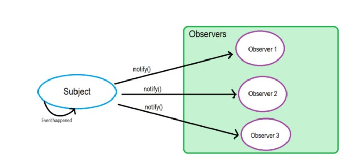

# 观察者模式&发布订阅模式

## 观察者模式

观察者模式中，定义了对象之间一对多的依赖，这样一来，当一个对象改变状态时，它的所有依赖者都会收到通知并自动更新。而观察者模式属于**行为型模式**，行为型模式**关注的是对象之间的通讯**，观察者模式就是观察者和被观察者之间的通讯。

，

### 使用proxy 实现观察者模式

```javascript
let queuedObservers = new Set();

const observe = fn => queuedObservers.add(fn);	// 观察这个行为的函数，例如 observe(a)表示有一个观察者观察 a 这个 object
const observable = obj => new Proxy(obj, {set}); // 被观察对象实例

function set(target, key, value, receiver) {
  const result = Reflect.set(target, key, value, receiver);
  queuedObservers.forEach(observer => observer(key)); // 注意这里有参数 key
  return result;
}

// 这里的观察者也有参数 key，上面的 observer(key) 其实就是 obs1(key) 和 obs2(key)
let obs1 = key => console.log(`key ${key} will change, this is ob1`); //定义观察者1号
let obs2 = key => console.log(`key ${key} will change, this is ob2`); //定义观察者2号

observe(obs1) //相当于queuedObservers.add(obs1)
observe(obs2) //相当于queuedObservers.add(obs2)
// 注意这里 obs1和 obs2是观察者，而不是被观察对象。

let obj = observable({key1: 111, key2: 222})
obj.key1 = 3 
// key key1 will change, this is ob1
// key key2 will change, this is ob2

// 这样一来，对数据一有变动，那么观察者就会立刻发现。
```

上面的代码实现的就是观察者模式，可以看到，上面的代码中：

* 观察者：queuedObservers中的 function
* 被观察对象：obj, 是一个 observable 实例，每次修改值(**这就是行为**)观察者都可以知道。

在这种模式中，被观察对象还保留了 observer 的记录(保留了queuedObservers，如果写成一个 object 那么这会是一个内置属性)

## 发布订阅模式


在“发布者-订阅者”模式中，称为发布者的消息发送者不会将消息编程为直接发送给称为订阅者的特定接收者。这意味着**发布者和订阅者不知道彼此的存在**。

存在第三个组件，称为**代理或消息代理或事件总线**，它由发布者和订阅者都知道，它过滤所有传入的消息并相应地分发它们。换句话说，pub-sub是用于在不同系统组件之间传递消息的模式，而这些组件不知道关于彼此身份的任何信息。经纪人如何过滤所有消息？实际上，有几个消息过滤过程。最常用的方法有：**基于主题和基于内容**的。


下面的场景假设有一家鞋店开了一家网店，小蓝小白小黑三个人都有自己想买的鞋，但是由于双11，货都没有了，于是需要在网店上订阅相关喜欢的鞋子和尺码。在这个场景下

* 网店就是消息中心，鞋店会通过网店来发布消息，用户通过网店来接收消息
* 鞋店实体本身是发布者，当有货到的时候，会去网店发布消息
* 小蓝小白小黑三个人是订阅者，当有货到的时候，会收到网店发布的消息。

```javascript
var shoeStore = {
		    messageList:{},
		    subscribe:function(){
		        let fn = Array.prototype.pop.call(arguments);
		        Array.from(arguments).forEach(type=>{
		            if(! Object.prototype.hasOwnProperty.call(this.messageList, type)){
		            		this.messageList[type] = []
		            		this.messageList[type].push(fn)
		            }
		        })
		    },
		    unsubscribe:function(){
		    		let fn = Array.prototype.pop.call(arguments);
		    		Array.from(arguments).forEach(type=>{
		    			let listener = this.messageList[type]
		            if (!listener || !listener.length) return;
					this.messageList[type] = listener.filter(item => item!=fn);
		       })
		    },
		    publish: function(){
		    		Array.from(arguments).forEach(type=>{
		    			let listeners = this.messageList[type]
		    			for (let i = 0;i<listeners.length;i++){
		    				listeners[i]()
		    			}
		    		})
		    }
		}
		shoeStore.subscribe(' yeezy',()=>{console.log('yeezy到了，通知小蓝')});
		shoeStore.subscribe('AJ',()=>{console.log('AJ到了，通知小白')});
		shoeStore.subscribe('AF1',()=>{console.log('AF1到了，通知小黑')});
		shoeStore.subscribe('40',()=>{console.log('40码到了，通知小蓝')});
		shoeStore.subscribe('43',()=>{console.log('43码到了，通知小白')});
		shoeStore.subscribe('48',()=>{console.log('48码到了，通知小黑')});
		shoeStore.publish('40','yeezy'); //40码到了，通知小蓝 yeezy到了，通知小蓝
		shoeStore.publish('AF1'); //AF1到了，通知小黑
```

例如使用 ajax发起请求，当请求结束后做两件事，第一件渲染数据，第二件实现动画

传统来说会写成这样：

```javascript
$.ajax(“http://127.0.0.1/index.php”,function(data){
    rendedData(data);  // 渲染数据
    doAnimate(data);  // 实现动画 
});
```

现在按照发布订阅模式的话就可以写成：

```javascript
$.ajax(“http://127.0.0.1/index.php”,function(data){
    Obj.trigger(‘success’,data);  // 发布请求成功后的消息
});
// 下面我们来订阅此消息，比如我现在订阅渲染数据这个消息；
Obj.listen(“success”,function(data){
   renderData(data);
});
// 订阅动画这个消息
Obj.listen(“success”,function(data){
   doAnimate(data); 
});
```

其中一个 obj 可以封装为：

```javascript
var Event = (function(){
    var list = {},
          listen,
          trigger,
          remove;
          listen = function(key,fn){
            if(!list[key]) {
                list[key] = [];
            }
            list[key].push(fn);
        };
        trigger = function(){
            var key = Array.prototype.shift.call(arguments),
                 fns = list[key];
            if(!fns || fns.length === 0) {
                return false;
            }
            for(var i = 0, fn; fn = fns[i++];) {
                fn.apply(this,arguments);
            }
        };
        remove = function(key,fn){
            var fns = list[key];
            if(!fns) {
                return false;
            }
            if(!fn) {
                fns && (fns.length = 0);
            }else {
                for(var i = fns.length - 1; i >= 0; i--){
                    var _fn = fns[i];
                    if(_fn === fn) {
                        fns.splice(i,1);
                    }
                }
            }
        };
        return {
            listen: listen,
            trigger: trigger,
            remove: remove
        }
})();
```


## 区别

1. 在Observer模式中，Observers知道Subject，同时Subject还保留了Observers的记录。然而，在发布者/订阅者中，发布者和订阅者不需要彼此了解。他们只是在消息队列或代理的帮助下进行通信。
2. 在Publisher / Subscriber模式中，组件是松散耦合的，而不是Observer模式。
3. 观察者模式主要以同步方式实现，即当某些事件发生时，Subject调用其所有观察者的适当方法。发布者/订阅者在大多情况下是异步方式（使用消息队列）。
4. 观察者模式需要在单个应用程序地址空间中实现。另一方面，发布者/订阅者模式更像是跨应用程序模式。

参考: [[观察者和发布订阅模式的区别](https://www.cnblogs.com/viaiu/p/9939301.html)]

